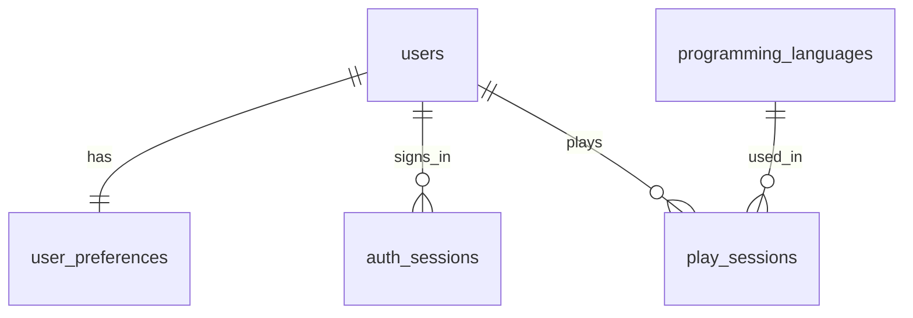

# TypingTrainer — Requirements Specification

| Field | Value |
| --- | --- |
| Version | 1.35 |
| Language of record | **English** (all deliverables from this point on) |
| Status | **Settled.** No open items; ready to implement |
| Supersedes | v1.34 — the localization foundation: language resources, switching, and translated API errors (§8.4, Appendix B) |

**Legend**

- 🔵 **Settled** — decided; implement as written.
- 🟡 **Proposal** — a deviation from the original draft spec, with rationale. All proposals in this version have been accepted.

---

## 1. Product Overview

### 1.1 Purpose

A typing trainer for programmers. Unlike general typing sites, which measure English prose, TypingTrainer measures **code keystrokes** — symbols, camel-case identifiers, brackets, and operators — and reports progress over time.

This is worth training separately: a developer's code typing speed typically lands at 55–70% of their prose speed, and the gap is caused almost entirely by symbol keys.

### 1.2 Goals

| # | Goal |
| --- | --- |
| G1 | No perceptible input lag or dropped keystrokes for a full 120-second run (key press to paint within 33 ms / 2 frames) |
| G2 | Typing feels like an IDE — automatic indentation and automatic closing brackets |
| G3 | Progress is visible at a glance across daily, weekly, and all-time views |
| G4 | CPU opponents are calibrated so that a player competes closely with the level near their own skill (40–60% win rate in the matching level band) |

### 1.3 Non-Goals

- Real-time matches against other people; friends; global leaderboards. **Rankings are strictly per-user** and no other user's data is ever displayed.
- Compiling or executing the practice code.
- Code completion / suggestions.
- Playing on phones or tablets (dashboard viewing is supported).
- Exact keystroke replay of past runs.

### 1.4 Users and Environment

| Item | Value |
| --- | --- |
| Audience | The owner plus acquaintances. ~10 registered users, **1–2 concurrent, 5 at peak** |
| Input device | Physical keyboard required. **US and JIS layouts both supported** |
| Browsers | Latest 2 versions of Chrome, Edge, Firefox, Safari |
| Viewport | 1280×720 or larger for play (two code blocks, plus a two-column layout in versus modes) |

### 1.5 Glossary

| Term | Definition |
| --- | --- |
| **Block** | A unit of exercise content: a coherent 5–30 line code fragment |
| **Typing program** | The internal form of a block: a sequence of atoms (§3.2) |
| **Atom** | `literal`, `auto`, or `separator` — the smallest unit of the typing program |
| **Separator** | An atom representing inter-token whitespace (a space or a line break) |
| **Raw keystrokes** | Every key the player pressed |
| **Effective keystrokes** | Keystrokes that advanced the cursor. **The basis for scoring** |
| **Miss** | An incorrect keystroke, deduplicated per cursor position |
| **KPM** | Keystrokes per minute: `effective keystrokes / 2` for a 120-second run |
| **Ghost** | A simulated opponent reproducing one of the player's own past records |

---

## 2. Functional Requirements Index

| ID | Feature | Priority | Phase |
| --- | --- | --- | --- |
| F-01 | Typing engine (matching, auto-insertion, measurement) | Must | P0 |
| F-02 | Single play | Must | P0 |
| F-03 | Language selection | Must | P1 |
| F-04 | Result screen (KPM, accuracy, miss rate, score) | Must | P1 |
| F-05 | Username + password authentication | Must | P1 |
| F-06 | Score persistence | Must | P1 |
| F-07 | Rankings — daily / weekly / all-time, top 10 each, own data only | Must | P1 |
| F-08 | Play history (list, delete) | Must | P1 |
| F-09 | Dashboard (three score-trend views) | Must | P2 |
| F-10 | vs CPU (levels 1–100) and conquest records | Must | P2 |
| F-11 | Ghost (vs a past personal record) | Should | P3 |
| F-12 | Appearance settings (font, size, colors) | Should | P3 |
| F-13 | Key sounds (hit / miss, selectable sound packs) | Should | P3 |
| F-14 | Localization (en / ja) | Should | P3 |
| F-15 | Account deletion (erases all data) | Should | P3 |
| F-16 | Content expansion to 150+ blocks per language | Should | P4 |

---

## 3. Typing Engine

Nearly all technical risk sits here. Automatic bracket closing, automatic indentation, and flexible inter-token spacing interact, so the naive "compare the player's key to the head of the remaining string" approach does not hold up. This section defines an internal representation first, then the matching rules.

### 3.1 Design Approach 🟡

Blocks are **compiled ahead of time into a typing program** (a sequence of atoms). At runtime the engine is a small state machine walking that sequence.

| Approach | Pros | Cons | Verdict |
| --- | --- | --- | --- |
| Raw string comparison with runtime special cases | Looks simple at first | Whitespace flexibility × auto-insertion × miss deduplication produce a combinatorial explosion of branches; effectively untestable | ❌ |
| **Pre-compiled typing program** | Matching reduces to a state machine. Maximum keystrokes per block is fixed, so scores are comparable. Lexing happens once, offline | Requires a compiler stage | ✅ **Adopted** |

Consequences:

- The browser never needs a lexer or grammar binary; the client ships no WASM parsers.
- The server can re-run the identical engine to validate a submitted result.
- Adding a language means adding an adapter and recompiling content — the core never changes.

### 3.2 Internal Representation

```ts
/** Smallest unit of a typing program. */
export type Atom =
  /** Characters the player must type. */
  | { kind: 'literal'; text: string }
  /**
   * Characters the engine inserts on the player's behalf: closing brackets and
   * line indentation. Never typed. `filledBy` is the index of the atom whose
   * completion makes this text appear as already-typed on screen.
   */
  | { kind: 'auto'; text: string; filledBy: number }
  /**
   * Alignment spaces a formatter inserts before an in-line separator (e.g. gofmt
   * aligning struct fields). Never typed, never counted, always displayed as plain
   * whitespace. 🟡 (v1.3)
   */
  | { kind: 'padding'; text: string }
  /**
   * Inter-token whitespace.
   * canonical === '\n' -> only Enter is accepted, and it is always required.
   * canonical === ' '  -> only Space is accepted; `required` per §3.3.1.
   */
  | { kind: 'separator'; canonical: '\n' | ' '; required: boolean };

export interface TypingProgram {
  blockId: string;
  atoms: Atom[];
  /** Maximum effective keystrokes: literal characters + separator count. */
  canonicalKeystrokes: number;
}
```

**Relationship to the display.** The screen always shows the **canonical, fully formatted code** — indentation and closing brackets included. The cursor moves left to right through it. The player's input never reflows the layout, so the displayed code can never become syntactically wrong.

### 3.3 Compilation Rules

#### 3.3.1 When a space separator is mandatory 🟡

The original draft said "mandatory when identifier tokens would run together." That misses operator fusion. The generalized rule:

> A separator between tokens `A` and `B` has `required = false` **only if** re-lexing `A.text + B.text` yields exactly `[A, B]`.

| Example | Joined | Re-lexed | `required` |
| --- | --- | --- | --- |
| `const` `x` | `constx` | `[constx]` | `true` |
| `return` `x` | `returnx` | `[returnx]` | `true` |
| `{` `1` | `{1` | `[{, 1]` | `false` |
| `+` `+` | `++` | `[++]` | `true` — missed by the draft spec |
| `-` `>` | `->` | `[->]` | `true` |
| `<` `<` | `<<` | `[<<]` | `true` |
| `not` `in` (Python) | `notin` | `[notin]` | `true` |

> The examples above are language-neutral illustrations. Whether two tokens fuse is decided by each language's own lexer (§5.4): TypeScript has no `->` token, so `-` `>` re-lexes to `[-, >]` and that separator is optional in TypeScript, whereas Java lexes `->` as one token and the separator is required there. Re-lexing is also deliberately conservative: the TypeScript adapter always rescans `>` as the longest operator it could start, so where nested type arguments end right before an assignment or comparison — `const cache: Map<string, Array<number>> = new Map();` — the final `>` and `=` re-lex as `>=` and the space before `=` is required, even though the parser would not fuse them in a type context. 🟡 (v1.2)

#### 3.3.2 Accepted keys at separators 🔵 (Q8, revised in v1.1)

| Canonical form | Accepted key | `required` | Behavior |
| --- | --- | --- | --- |
| Line break | **Enter only** | Always `true` | Consuming it **advances immediately** and triggers automatic insertion of the next line's indentation. Another Enter is judged at the next position: correct only if a line break is due there too (e.g. leaving a line that holds only an auto-inserted `}`), otherwise a miss |
| In-line space | **Space only** (Tab is rejected) | Per §3.3.1 | Repeated spaces are accepted but counted once (§3.5). If `required = false`, the player may skip straight to the next character, or press Enter when the next typed atom is a line break (e.g. `return { ok: true }` at the end of a line) |

Separators can follow one another with only `auto` atoms between them: `return { ok: true }` at the end of a line compiles to `' '`, auto `}`, `'\n'`. The transition rules in §3.4 let the player pass through such chains; the v1.0 algorithm could not (Appendix B, v1.1).

Rationale for not letting Space stand in for a line break: because the display is fixed to the canonical form, allowing it would not corrupt the code — but it would let a player finish an entire run **without ever pressing Enter**, and automatic indentation (a real IDE keystroke) would drop out of the exercise entirely. In-line spacing keeps the flexibility from the original spec: `{1, 2, 3}`, `{1,2,3}`, and `{1,   2,    3}` are all accepted.

#### 3.3.3 Automatic insertion 🔵

| Target | Rule |
| --- | --- |
| Indentation | Every line's leading whitespace becomes an `auto` atom, filled when the preceding Enter is consumed |
| `)` `]` `}` | Filled when the matching opening character is typed |
| `'` `"` `` ` `` | String literal **tokens** are identified by the lexer before pairing, so the apostrophe in `"don't"` is never treated as an opening quote |
| `<` `>` | **Not paired** 🔵 (Q7) — ambiguous with comparison operators |
| Escapes (`\n`, `\"`) | Remain `literal`; both characters must be typed |
| Alignment padding | Spaces a formatter adds beyond the single in-line separator to align code (e.g. gofmt) become a `padding` atom directly before that separator. It has no `filledBy`, is never typed, and displays as plain whitespace from the start 🟡 (v1.3) |

Structural rules 🟡 (v1.3): an indentation `auto` atom is filled by the line-break separator immediately before it; a closing `auto` atom is filled by an earlier literal — the matching opener, which the block compiler guarantees because openers are language-specific; a `padding` atom directly follows a literal or a closing `auto` atom and directly precedes an in-line space separator. `TypingProgramSchema` enforces all three.

#### 3.3.4 Typing a character that was auto-inserted 🔵 (Q6)

Once an `auto` atom is filled, its characters are **already typed**. Pressing that character is therefore a **miss**, not a no-op.

- Typing `(` immediately renders the matching `)` in the "typed" color.
- Pressing `)` at that point is a miss, because the character is already on screen.
- The same applies to auto-inserted indentation: pressing Space at the start of an auto-indented line is a miss 🔵 (Q30). This needs no special handling — once `settle` has passed the indentation, a space simply fails to match the expected literal character and falls through to `markMiss`.

This mirrors an IDE, where the extra keystroke would insert a duplicate character, and it keeps the maximum effective keystrokes per block fixed.

**Literal after a separator** 🟡 (v1.2). A literal atom that follows a separator, ignoring any `auto` atoms between them, must not start with a space: Space would be consumed or ignored by the separator and could never reach the literal (§3.4). Lexer tokens never begin with whitespace, but the text part of a template literal can — `` `${ user.id } (x)` `` yields a separator, an auto `}`, then the literal ` (x` — so the block compiler rejects this shape with a positioned error, and `TypingProgramSchema` enforces it as a final check.

### 3.4 Runtime Matching Algorithm 🟡 (revised in v1.1)

The engine is a set of pure functions: `handleKey` returns a new state and never mutates its input. Whether a keystroke was correct (`Verdict`) and whether the program is finished (`isComplete`) are separate questions with separate answers.

```ts
interface EngineState {
  program: TypingProgram;
  /** Current atom. Never an `auto` or `padding` atom (see settle); atoms.length once complete. */
  atomIndex: number;
  charIndex: number;
  /** Whether a space has been consumed at the current in-line separator. */
  separatorConsumed: boolean;
  /** Whether a miss has already been recorded at the current cursor position. */
  missMarkedHere: boolean;
  counters: { raw: number; effective: number; miss: number; ignored: number };
}

type Verdict = 'CORRECT' | 'MISS' | 'IGNORED';

export function isComplete(state: EngineState): boolean {
  return state.atomIndex >= state.program.atoms.length;
}

export function handleKey(prev: EngineState, key: string): { state: EngineState; verdict: Verdict } {
  if (isComplete(prev)) return { state: prev, verdict: 'IGNORED' }; // no-op, counters untouched
  const s = copy(prev);
  s.counters.raw += 1;

  for (;;) {
    const atom = s.program.atoms[s.atomIndex];

    if (atom.kind === 'literal') {
      if (key !== atom.text[s.charIndex]) return done(s, markMiss(s));
      s.counters.effective += 1;
      advanceChar(s);
      return done(s, 'CORRECT');
    }

    if (atom.canonical === '\n') {
      if (key !== 'Enter') return done(s, markMiss(s));
      s.counters.effective += 1;
      advanceAtom(s); // a line break advances as soon as it is consumed
      return done(s, 'CORRECT');
    }

    const next = nextTypedAtom(s); // the next atom that is not 'auto' or 'padding'

    if (s.separatorConsumed) {
      if (key === ' ' && !(next?.kind === 'separator' && next.canonical === ' ')) {
        s.counters.ignored += 1; // consecutive whitespace: accepted, counted once
        return done(s, 'IGNORED');
      }
      advanceAtom(s); // pass through; already credited when consumed
      continue;
    }

    if (key === ' ') {
      s.counters.effective += 1;
      s.separatorConsumed = true;
      settle(s);
      return done(s, 'CORRECT');
    }
    if (atom.required || key === 'Tab') return done(s, markMiss(s));
    if (key === 'Enter' && next?.kind !== 'separator') return done(s, markMiss(s));

    s.counters.effective += 1; // optional separator skipped: still credited, see §3.5
    advanceAtom(s); // pass through and judge the same key at the next typed atom
  }
}
```

Helpers:

- `advanceChar` / `advanceAtom` move the cursor, reset `separatorConsumed`, and call `settle`.
- `settle` skips **every** consecutive `auto` and `padding` atom (v1.3), so `foo(bar(baz(1)))` passes all three `)` in one step. If only such atoms and passable separators (consumed, or optional) remain, it passes them all — crediting unconsumed separators — so the program completes on the last typed character without an extra keystroke (e.g. `export { a, b }`).
- `markMiss` increments `miss` only if `missMarkedHere` is false, then sets it.
- `missMarkedHere` is cleared whenever the cursor position `(atomIndex, charIndex)` actually advances — not merely when a verdict is `CORRECT`.

**Separator transitions.** U-req = unconsumed and required; U-opt = unconsumed and optional; C = consumed (in-line spaces only, since a line break advances immediately). *Pass* = move on and judge the same key at the next typed atom, crediting +1 only when leaving U-opt. `nextTyped` = the next atom that is not `auto` or `padding`.

| `' '` separator | Space | Enter | Tab | Other character |
| --- | --- | --- | --- | --- |
| U-req | Consume → C, `CORRECT` | `MISS`, stay | `MISS`, stay | `MISS`, stay |
| U-opt | Consume → C, `CORRECT` | Pass if `nextTyped` is a separator; otherwise `MISS`, stay | `MISS`, stay | Pass |
| C | Pass if `nextTyped` is a `' '` separator; otherwise `IGNORED` | Pass | Pass | Pass |

| `'\n'` separator (always U-req) | Enter | Anything else |
| --- | --- | --- |
| | Consume and advance, `CORRECT` | `MISS`, stay |

At C the caret is already drawn past the space, so everything except a repeated Space passes through. As a result a miss is never recorded at C and then again at the following atom.

Each separator is credited exactly once — when consumed, or when passed from U-opt — so a completed block always totals `canonicalKeystrokes` effective keystrokes (§3.5).

**Worked examples.**

- **Skipping `f` in `for`:** `o` records a miss; `r` is at the same position, so nothing further is recorded. **One miss.**
- **`foo(bar(baz(1)))` + line break:** typing `1` settles past all three auto `)` onto the line break. Enter is `CORRECT`; `)` is a `MISS` (Q6).
- **`return { ok: true }` + line break** (`' '`, auto `}`, `'\n'`): `true⏎`, `true ⏎`, and `true  ⏎` are all accepted with identical effective keystrokes. The second space is `IGNORED` because the next typed atom is a line break, not a space.
- **A line holding only an auto `}`:** one Enter enters the line and one Enter leaves it. An extra Enter where a character is due is a miss, and further Enters at that position are not counted again.

### 3.5 Scoring Fairness Rule 🟡

**Problem.** Optional separators may be skipped. If only physically pressed keys were counted, skipping them would *lower* the keystroke count and therefore the score — punishing the player for using a permitted shortcut.

**Rule.** A separator credits **one effective keystroke when it is passed**, whether or not a space was actually pressed.

Consequences:

- A block's effective keystroke total equals `canonicalKeystrokes` regardless of typing style.
- Progress comparisons against CPU and Ghost opponents are exact.
- For a given block sequence the theoretical maximum score is fixed, so rankings are fair.

### 3.6 Metrics and Score 🔵

Play duration is **fixed at 120 seconds** (§4.1), so all per-minute figures divide by 2.

| Metric | Formula |
| --- | --- |
| Effective keystrokes | `effective` |
| KPM | `effective / 2` |
| Accuracy | `effective / (effective + miss)`; `0` when both are `0` |
| Miss rate | `1 − accuracy` |
| **Score** | `round(KPM × accuracy)` (Q1, Q3) |
| Raw keystrokes | `raw` — diagnostics and anomaly detection only |

Misses are penalized twice, by design: they do not advance the cursor, and they reduce the accuracy multiplier.

**Exact rounding** 🟡 (v1.10). `KPM × accuracy` equals `effective² / (2 × (effective + miss))`, and the score is computed from that ratio of integers, rounding halves up. Multiplying the floating-point KPM by the floating-point accuracy can land just below an exact half — for 165 effective keystrokes and 60 misses it gives 60.49999999999999 instead of 60.5 — so the client and the server must both use the integer form, via `typing-engine`'s `computeMetrics`.

### 3.7 Input Handling Notes

| Item | Approach |
| --- | --- |
| Event | `keydown`; read `event.key` (`keypress` is deprecated) |
| Modifiers | Modifier-only presses are not counted. Capitals arrive as uppercase `event.key`, so Shift adds no keystroke |
| Browser shortcuts | When `Ctrl` or `Meta` is held, pass the event through untouched |
| `Tab` | `preventDefault()` to block focus movement, then treat as a miss (§3.3.2) |
| Backspace | **Disabled** 🔵 (Q4). Progress is forward-only |
| IME | A Japanese IME blocks input entirely. Detect `compositionstart` and show a "turn off your IME" notice |
| Focus | Keep an off-screen `<input>` focused; auto-pause on `blur` |
| Timing | `performance.now()` (`Date.now()` can step backwards under NTP correction). Drive the countdown with `requestAnimationFrame` |
| Rendering | 30 lines × 80 characters ≈ 2,400 nodes. Re-rendering all of them per keystroke is too slow — **memoize per line and repaint only changed lines** |
| Layouts | Matching is `event.key`-based, so US and JIS layouts work without branching 🔵 (Q26) |

---

## 4. Play Modes

### 4.1 Common Rules 🔵

| Item | Value |
| --- | --- |
| Duration | **Fixed at 120 seconds**, not user-configurable. Held as an application constant, not a setting |
| Blocks on screen | Always at least two: the current block and the next one |
| Time expiry | The run ends immediately, mid-block if necessary; partial progress counts (Q5) |
| Countdown start | The countdown starts with the first keystroke, not when the session is issued or the screen appears 🟡 (v1.10) |
| Pauses | Losing focus pauses the countdown (§3.7); run time excludes pauses 🟡 (v1.10) |
| Idle limit | **Idle time** is the wall-clock time since the session was issued minus the run time consumed, so it includes the wait before the first key and every pause, however they are split. A run idle for more than **15 minutes** is discarded and never saved; the client stops it and the server rejects it using its own clock (§9.8) 🟡 (v1.10) |
| All blocks done early | If all issued blocks are finished before 120 seconds, the run ends then; KPM is still `effective / 2` 🟡 (v1.10) |
| Versus modes | The player and the opponent receive an **identical block sequence** |
| Layout | Two columns — **left: player, right: opponent** |

### 4.2 Single Play

Solo. Results are always saved.

### 4.3 vs CPU

#### 4.3.1 Calibration Basis

Published speed figures, converted at the conventional 5 keystrokes per word:

| Reference | Figure | Source summary |
| --- | --- | --- |
| Average office worker, prose | ~40 WPM | dev.to, "How Fast Do Developers Actually Type?" |
| Professional developer, prose | 50–70 WPM | typespeedtest.com |
| Professional developer, **code** | 30–45 WPM | typingfastest.com, informal survey of 200+ developers |
| Code / prose ratio | 55–70% | turbotype.co |
| Official world record, prose | 212 WPM (Dvorak) | Guinness — Barbara Blackburn; 216 WPM sustained for 50 minutes, 227 WPM peak |
| Sustained competitive speed | 174 WPM at 99.2% accuracy | Sean Wrona, Ultimate Typing Championship |
| Unofficial peak (15-second burst) | 293–305 WPM | MythicalRocket, 97% accuracy |

**Level 100 = 800 KPM** (160 code WPM): a world-class typist sustaining 200–250 prose WPM, times a 0.65 code factor, lands at 650–800 KPM. The upper end is used, matching "a coin flip against the fastest person alive."

**Level 1 = 50 KPM** 🔵 (Q13): 10 code WPM — below anyone who can find the keys.

#### 4.3.2 Level → Speed

Geometric interpolation, because skill scales multiplicatively.

```
baseKpm(level) = 50 × (800 / 50) ^ ((level - 1) / 99)
```

| Level | Base KPM | Code WPM | CPU score | Comparable skill |
| --- | --- | --- | --- | --- |
| 1 | 50 | 10 | 50 | Anyone beats this |
| 10 | 64 | 13 | 64 | Learning to touch-type |
| 20 | 85 | 17 | 85 | Beginner |
| 30 | 113 | 23 | 113 | 1–2 years of practice |
| 40 | 149 | 30 | 149 | Lower end of working developers |
| **48** | **186** | **37** | **186** | **Average professional developer** |
| 50 | 197 | 39 | 197 | Slightly above average |
| 60 | 261 | 52 | 261 | Fast developer |
| 70 | 345 | 69 | 345 | Fastest on the team |
| 80 | 457 | 91 | 457 | Entry-level competitive typist |
| 90 | 605 | 121 | 605 | Top-tier competitive typist |
| 100 | 800 | 160 | 800 | World class |

Cross-check: an average professional at 39 code WPM (195 KPM) and 95% accuracy scores 185 — an even match against level 48, and a narrow loss to level 50.

**CPU accuracy is 100%** 🔵 (Q28), consistent with the Ghost (§4.4), so `CPU score = base KPM × block multiplier`. The CPU never mis-types, which removes miss simulation from the opponent model entirely and makes the level-to-score mapping the identity function. All variance comes from §4.3.3.

#### 4.3.3 Variance 🟡

The draft's 0.99–1.01 range (±1%) is far smaller than a human's own run-to-run variation (typically ±5%), so every match would end the same way.

```
blockMultiplier ~ TruncatedNormal(mu = 1.0, sigma = 0.02, clipped to [0.94, 1.06])
keyInterval     ~ LogNormal(mean = 60000 / targetKpm, sigma = 0.20)   // mu = ln(mean) - sigma^2 / 2
```

| Layer | Distribution | Purpose |
| --- | --- | --- |
| Per-block multiplier | Truncated normal, σ = 2%, clipped at ±6% | Gives each match a "form on the day," keeping same-band win rates in the 40–60% range |
| Per-keystroke jitter | Log-normal, σ = 20% | Avoids a metronome look; leaves mean speed unchanged |
| Character-class weights | Lowercase/digits 1.0, anything needing Shift (uppercase letters and shifted symbols) 1.5, other symbols 1.3, separators 0.8 | Reproduces "slowing down on symbols." Normalized by the block's mean cost so the target KPM still holds |

The RNG seed is issued by the server and stored on the session row, so any match can be reproduced for debugging.

#### 4.3.4 Conquest Records 🔵

| Item | Rule |
| --- | --- |
| Condition | `player score >= CPU score`. **A tie counts as a win** (Q16) |
| Key | `(user, language, level)`. Beating level 50 in Java says nothing about level 50 in C++ |
| Recorded only in | **vs CPU mode.** A high score in single play never counts toward conquests (Q2) |
| Duration | Not part of the key — duration is fixed at 120 s (Q14) |
| Display | Per language: highest level beaten, a grid of levels beaten, total conquest count |
| On history deletion | **Conquest records are deleted along with the play record** (Q15). They are therefore **derived from `play_sessions`, not stored separately** (§9.3) |

### 4.4 Ghost 🔵

Name settled as **Ghost** (Q11). The `mode` value, DB enum, and UI label all use `ghost`.

| Item | Rule |
| --- | --- |
| Opponent behavior | Advances through the same block sequence at a **constant interval**, at **100% accuracy**. No keystroke replay, now or later (Q12) |
| Source record | The player's personal best for the selected period: daily, weekly, or all-time |
| Missing record | If no record exists for the selected period, the option is disabled with a short explanation |

**Pace derivation** 🔵 (Q32): because the Ghost never misses, its score equals its KPM. Driving it at the record's *KPM* would make it score higher than the record itself — the original run's accuracy discount would vanish — so beating the Ghost would be strictly harder than beating the record. The Ghost is therefore paced by the recorded **score**:

```
ghostKpm = recordedScore     // score = KPM × accuracy, and ghost accuracy = 1.0
```

which makes the Ghost's final score exactly equal to the record, so "beat the Ghost" and "beat your record" mean the same thing.

---

## 5. Content

### 5.1 Block Requirements 🔵

| Item | Rule |
| --- | --- |
| Length | 5–30 lines |
| Coherence | A self-contained unit: a whole function, a declaration through its use, a class definition, imports through a function definition |
| Dependencies | Core syntax and the standard library only. No third-party packages or frameworks |
| Characters | **Printable ASCII only** (Q10) |
| **Comments** | **Not allowed.** Comments are not typing targets, so blocks are generated without them and the validator rejects any comment token (Q10) |
| Forbidden | Tab characters (indentation is normalized to spaces), trailing whitespace, CRLF, blank lines inside a block; runs of spaces between tokens, except alignment spaces a language's formatter inserts (§3.3.3); tokens spanning lines, such as Go raw strings, Java text blocks, or Python triple-quoted strings. Both are checked by the language-neutral block compiler for every adapter (`multiple-spaces`, `multiline-token`), so an adapter needs no check of its own 🟡 (v1.4). Between tokens only spaces and line breaks may appear: the block compiler checks this as an allow-list, so comments (`comment`), explicit line continuations (`line-continuation`), and any other text (`unexpected-text`) are rejected in every language without adapter-specific rules 🟡 (v1.6) |

Prohibiting comments also removes a special case from the engine: there is no longer any "a line comment can only end with a newline" rule to handle.

### 5.2 Authoring Pipeline 🔵 (Q21, Q23)

Blocks are **authored offline and committed to the repository**. There is no LLM call at runtime and no API key in any deployed environment. Generation happens on the author's machine using existing GitHub Copilot Pro and Claude Pro subscriptions, so there is no per-request cost to model.

```
[ Author drafts blocks with an LLM, locally ]
        |
        v  content/blocks/<language>/<name>.<ext>   (committed source files; blockId = <language>/<name>)
[ pnpm content:build ]   (all stages)        [ pnpm content:check ]   (stages marked * need no toolchain)
        |-- 1. discover        file naming and unique block ids *
        |-- 2. format          byte-equal to the formatter: Prettier defaults *, gofmt, google-java-format, black (py312)
        |-- 3. toolchain       TypeScript syntax diagnostics *, gofmt -e, javac parse, CPython 3.12 compile() with warnings as errors
        |-- 4. tree-sitter     parse each (wrapped) fragment; reject ERROR and MISSING nodes *
        |-- 5. constraints     5-30 lines, block shape per language, stdlib-only imports *
        |-- 6. compile         emit the typing program (§3.3) with block-compiler *
        |-- 7. dedupe          content hash, plus token 4-gram similarity across the language *
        v
[ content/dist/<language>.bundle.json ]  (committed; revision = SHA-256 of the canonical blocks JSON)
[ content/dist/toolchains.json ]         (formatter and compiler versions used by the last full build)
```

Because fragments such as "just a variable declaration" are legal blocks, the checker uses an error-recovering parser (tree-sitter) and, per language, wraps fragments before parsing (for example, wrapping an expression in `function __wrap() { ... }`) so that incompleteness alone does not fail validation.

**Toolchains decide, tree-sitter screens** 🟡 (v1.8, v1.11). tree-sitter grammars are error-tolerant and miss mistakes that each language's own compiler reports, so the language toolchain (stage 3) is the authoritative syntax check, run locally and in a dedicated CI job. tree-sitter (stage 4, WebAssembly) runs everywhere, including the regular CI job without toolchains, as a fast screen. Measured with tree-sitter TypeScript 0.23.2, Go 0.25.0, Java 0.23.5, and Python 0.25.0:

| Language | tree-sitter misses (toolchain catches) | tree-sitter wrongly rejects |
| --- | --- | --- |
| TypeScript | `08` (leading zero) | — |
| Go | an opening brace on the next line | — |
| Java | `'ab'` (multi-character char literal) | `1__0`, a valid literal |
| Python | `01`, `1_`, `1if y else 2`, t-strings, a `def` without an indented body | — |

A block that tree-sitter wrongly rejects is rewritten rather than exempted, keeping the regular CI check simple.

Review happens through pull requests: a block reaches production only when the bundle is rebuilt and merged. No draft/approval state machine is needed in the database.

### 5.3 Block Selection 🔵

| Rule | Detail |
| --- | --- |
| Within a run | **No repeats while unused blocks remain.** Shuffle the language's pool with the session seed and draw without replacement |
| Pool exhausted mid-run | Reshuffle and continue, excluding the block just played so the same one never appears twice in a row |
| Across runs | **No memory.** The previous run has no influence on this run's draw (Q, "previous play is not considered") |
| Sequence issuance | The server issues **20 compiled blocks** with the session. At 800 KPM a 120-second run consumes roughly 1,600 effective keystrokes; even short blocks (~125 keystrokes) cannot exhaust 20. No network call occurs mid-run, and versus opponents are guaranteed identical content |

### 5.4 Languages 🔵 (Q9)

Each language is implemented as an adapter; the core engine knows nothing about any specific language.

```ts
export interface LanguageAdapter {
  readonly slug: string;
  tokenize(source: string): Token[];
  /** Decides separator requirements between two tokens (§3.3.1). */
  separatorRule(prev: Token, next: Token): SeparatorRule;
  /** Characters eligible for automatic closing. */
  pairRules(): PairRule[];
  /** Indentation width and style. */
  indentRule(): IndentRule;
}
```

| Stage | Languages |
| --- | --- |
| Initial (P0–P2) | **TypeScript, Python, Java, Go** |
| Later (P3+) | C++, C#, Rust, SQL, Kotlin — adapter addition only |

#### 5.4.1 Per-Language Notes

Recommended implementation order is **TypeScript → Go → Java → Python**, easiest quirks first, with Python still inside P0 so that the hardest case validates the design early.

| Language | Notes |
| --- | --- |
| **TypeScript** | Generic `<>` is not auto-paired (§3.3.3). Template literals `` `${x}` `` nest, so pairing must work on lexer tokens. `=>` stays two keystrokes; font ligatures are disabled (§8.2) |
| **Go** | Line breaks are **semantically significant** — the compiler inserts semicolons at line ends — so every end-of-line separator is `required`. A brace on the following line is a syntax error, so generated blocks are fixed to `gofmt` output. Go's native indentation is tabs; blocks are **normalized to spaces** to remove tab-width variation between environments. Normalization converts each leading tab to **4 spaces**, and gofmt's alignment spaces become `padding` atoms (§3.3.3). Because gofmt inserts blank lines between top-level declarations of different kinds, a Go block holds **exactly one top-level declaration** 🟡 (v1.4) |
| **Java** | Verbose, so blocks hit the 30-line cap quickly. Favor **single methods** over whole `import` + class listings. The `@` in annotations is a shifted symbol (cost weight 1.5). Blocks are google-java-format output (2-space indentation, no alignment spaces) holding exactly one member, because the formatter inserts blank lines between members. Text blocks are excluded in P0: they always span lines and fail with `multiline-token`. Unicode escapes (`\uXXXX`) are forbidden anywhere in the source (`unicode-escape`), because javac translates them before lexing, so the displayed characters would not match the tokens 🟡 (v1.5) |
| **Python** | The hardest case, because indentation is syntax.<br>• Dedents cannot be expressed by the player, so the canonical indentation is fully precomputed as `auto` atoms.<br>• A line break after `:` is always a required Enter separator.<br>• Compound keywords such as `not in` and `is not` fall out of §3.3.1 as `required = true` automatically.<br>• f-strings embed expressions inside a string token; pair detection must run on the whole token.<br>• Blank lines are forbidden inside blocks (§5.1), which also avoids ambiguity about indentation after them. Blocks target **Python 3.12** and are black output (`--target-version py312`): 4-space indentation, no alignment spaces, and exactly one top-level definition — a function, or a class with a single method — because black inserts blank lines between members and around nested definitions. INDENT and DEDENT need no atoms of their own: the canonical indentation after each line break is an `auto` atom, so leaving several levels at once is one Enter. f-string brace escapes (`{{`, `}}`) are forbidden (`fstring-brace-escape`), t-strings (Python 3.14) are rejected, and a keyword directly after a number (`1if`, a SyntaxWarning in 3.12) is a syntax error 🟡 (v1.7) |

---

## 6. Scores, Rankings, Dashboard, History

### 6.1 Rankings 🔵

| Item | Rule |
| --- | --- |
| Scope | **The signed-in user only.** No other user's data is ever returned or displayed |
| Periods | Daily (today), weekly (**Sunday–Saturday**), all-time |
| Size | Top 10 per period |
| Order | Score descending; ties broken by earlier timestamp |
| Partitioning | **By language only** (Q2). Single play, vs CPU, and Ghost runs all compete in one ranking. Duration is fixed, so it is not a partition key |
| Exclusions | Deleted history is gone from the table, so nothing to exclude |

Mode is deliberately *not* a partition key: all modes use the same engine, the same block pool, and the same 120 seconds, so their scores are directly comparable. A strong vs CPU run belongs on the same board as a strong solo run.

### 6.2 Dashboard 🔵

| View | X axis | Aggregation |
| --- | --- | --- |
| Daily | Time of day | Every run that day (raw points) |
| Weekly | Sunday–Saturday, 7 points | **Best score per day** |
| All-time | **Only days that were played**, gaps collapsed | Best score per day |

"Collapse the gaps" is implemented by treating the X axis as a **category axis** of played-date labels rather than a time axis: 100 played days out of 365 produce 100 points.

🟡 The all-time series grows without bound, so add a **range filter** (last 30 / 90 / 365 days / all) and paging; several thousand points are unreadable and waste bandwidth. A summary strip sits above the charts: total runs, cumulative keystrokes, best score per language, and highest CPU level beaten.

### 6.3 Play History 🔵

| Item | Rule |
| --- | --- |
| Columns | Timestamp, mode, language, KPM, accuracy, score, match result |
| Filters | Period, mode, language |
| Deletion | Per row. **Hard delete only** (Q18) — no soft delete, since there is no restore feature. Rankings, dashboard, and conquest records all update immediately because they are derived from the same table |
| Confirmation | Deletion is irreversible, so it is behind a confirmation dialog |
| Account deletion | Erases the user and all associated rows (Q19) |

🟡 (v1.16) The "updates immediately" claim rests on rankings, dashboard, and conquest records
being plain queries over `play_sessions` with nothing cached or denormalized in between; deleting
a row is therefore visible on the next request by construction, not by any synchronization step.
U9 verified this directly for rankings with an integration test: create two runs, confirm both
appear in the ranking, delete the higher-scoring one through `DELETE /api/history/:id`, and
confirm the ranking updates to the remaining run. U11 does the same for the dashboard (both the
chart points and the summary), and U13 does it for conquest records: deleting the winning run
removes the conquest on the next request, and a level stays beaten while another winning run at it
remains. Rankings, dashboard, and conquest records are therefore all verified.

### 6.4 Time Zone Handling 🟡 (Q17)

Taking the browser's time zone on every request would make past daily and weekly aggregates **shift whenever the user travels or changes networks** — last week's record could move into a different week.

| Approach | Verdict |
| --- | --- |
| Aggregate by the browser's current time zone | ❌ Past aggregates move; requires runtime conversion on every query |
| **Fix day boundaries by a profile time zone** — detected from `Intl.DateTimeFormat().resolvedOptions().timeZone` at registration, editable in settings | ✅ **Adopted** |

- Stored per run: `started_at timestamptz` (UTC), `timezone` (IANA name), and denormalized **`local_date`** and **`local_week_start`**.
- Daily and weekly rankings become simple indexed equality lookups with no time-zone math at query time.
- Changing the profile time zone triggers a batch recomputation of `local_date` and `local_week_start` for that user. At personal scale this is trivially cheap.

---

## 7. Authentication 🔵

| Item | Approach |
| --- | --- |
| Method | **Username and password only** |
| Password storage | **Argon2id** (OWASP recommendation), with a pepper supplied via environment variable 🟡 (v1.13): the OWASP minimum of 19 MiB, 2 passes, 1 lane, a 32-byte hash, and a random 16-byte salt, stored as a PHC string so a stored hash records its parameters and is upgraded on sign-in when they change. Passwords are NFKC-normalized before hashing. The pepper (`PASSWORD_PEPPER`, at least 32 bytes) is Argon2's `secret` and is never stored; it must be kept apart from the database and its backups, because losing it invalidates every password. The implementation is `@node-rs/argon2`, which ships prebuilt musl bindings for arm64 and amd64. Node's built-in `crypto.argon2` (added in v24.7.0) was rejected while it is Stability 1.2 (release candidate); **when it reaches Stability 2 (stable), migrating to it is to be reconsidered**. Because `@node-rs/argon2` accepts no associated data, RFC 9106 §5.3 cannot run through it: tests check it against the reference implementation's Argon2id vectors (`src/test.c`), check `node:crypto` against RFC 9106 §5.3, and require the stored hash to equal `node:crypto`'s output for the same salt, pepper, and parameters |
| Usernames and passwords | 🟡 (v1.13) Usernames: 3–24 characters, letters, digits, `_` and `-`, starting with a letter or digit; unique regardless of letter case (citext), stored as typed. The same rule is the `chk_users_username` constraint, and a test keeps it and the contracts schema in agreement. Passwords: 🟡 (v1.19) **8–128 characters** (a deliberate relaxation of NIST SP 800-63B-4's 15 for single-factor authentication), counted in code points after NFKC normalization; no composition rules; not equal to the username. Error messages never include the submitted value. Sign-in only bounds lengths, so a later policy change cannot lock out an existing account |
| Session | Server-side session plus an `httpOnly`, `Secure`, `SameSite=Lax` cookie. No browser-stored JWTs, which cannot be revoked 🟡 (v1.12): the cookie holds a 256-bit random token and `auth_sessions` stores only its SHA-256, so a leaked table cannot be replayed. A session ends **7 days after its last use** or **30 days after sign-in**, whichever comes first. Both limits are judged in the SQL that looks the session up, against the database clock (`expires_at > now() AND last_seen_at > now() - interval '7 days'`), never recomputed in application code; `last_seen_at` is refreshed at most once an hour, so a session can end up to an hour early but never late. 🟡 (v1.13) The cookie is `__Host-tt_session` with `HttpOnly`, `Secure`, `SameSite=Lax`, `Path=/`, no `Domain`, and `Max-Age` of 30 days; the `__Host-` prefix stops a subdomain from setting or shadowing it. Development serves the web app over `http://localhost`, so there the cookie is `tt_session` without `Secure`. Every sign-in issues a new session and deletes the one presented, so a token planted before sign-in is never promoted. A user keeps at most the 10 newest sessions, and expired or idle sessions are deleted hourly. Every route requires a session unless it is marked public (health, languages, register, login, logout) |
| CSRF | `SameSite=Lax` plus Origin validation on state-changing requests 🟡 (v1.13): before any body is parsed, every POST, PUT, PATCH, and DELETE must carry an `Origin` equal to `APP_ORIGIN` (scheme, host, and port), or, when a browser omits `Origin`, a `Referer` with that origin; otherwise 403. A request with a body must be `application/json`, otherwise 415, since HTML forms cannot send JSON and the Fastify adapter would otherwise parse form bodies. Sign-in and registration are covered too, which prevents login CSRF. CORS is not enabled; the web app is served from the same origin |
| Rate limiting | Per-IP and per-account limits on login and registration, with exponential backoff 🟡 (v1.13): sign-in allows 20 attempts per client address per 15 minutes; per account (lower-cased username, existing or not), the fifth consecutive failure blocks for 1 s, doubling to a 15-minute cap, and a success clears it. Registration allows 5 attempts per address per hour and `REGISTRATION_DAILY_LIMIT` (default 20) accounts created in any 24 hours across all clients. Refusals are 429 with `Retry-After`. Client addresses come from `X-Forwarded-For` only for proxies listed in `TRUST_PROXY` (addresses or CIDR ranges; no hop counts). **Known limitation:** counters are kept in the single API process (§9.7), bounded to 10,000 keys each, and **reset when the process restarts** |
| Account enumeration | 🟡 (v1.13) An unknown username and a wrong password get the same 401 body after the same Argon2 verification: the dummy hash verified for unknown usernames is created when the application starts, not on first use, so the first attempt is not slower. The per-account backoff applies to unknown usernames as well. Registration answers 409 for a taken username, which open sign-up cannot hide; the per-address limit bounds probing |
| Registration policy | **Open sign-up** 🔵 (Q31). Rate limiting on the registration endpoint is the only guard; because rankings are strictly per-user, an unwanted account can see nothing but its own empty data. Tightening to an invite code later requires no schema change |

---

## 8. UI / UX

### 8.1 Play Screen

```
+----------------------------------------------------------+
|  TypeScript        vs CPU Lv.50                 87s left |
+---------------------------+------------------------------+
|  YOU                      |  CPU Lv.50                   |
|  KPM 214  ACC 96%  SCORE  |  KPM 197  ACC 100%  SCORE    |
|  +----------------------+ |  +-------------------------+ |
|  | current block        | |  | current block (same)    | |
|  | typed / cursor /     | |  | progress only           | |
|  | pending / auto-filled| |  |                         | |
|  +----------------------+ |  +-------------------------+ |
|  | next block (dimmed)  | |  | next block (dimmed)     | |
|  +----------------------+ |  +-------------------------+ |
+---------------------------+------------------------------+
```

| Character state | Presentation |
| --- | --- |
| Typed | Confirmed color |
| Cursor | Caret plus background highlight |
| Pending | Waiting color |
| **Auto-filled** | Same "typed" color as characters the player typed 🔵 (Q6) — a `)` turns typed the moment `(` is pressed |
| Auto, not yet filled | Dimmed, marking it as something the player will not type |
| Alignment padding | Plain whitespace from the start, never dimmed, underlined, or highlighted; it is not typed and the caret never rests on it 🟡 (v1.3) |
| Miss | Flash the cursor position in the error color for ~150 ms |

🟡 (v1.15) The diagram above is the vs CPU layout (P2); single play (P1, F-02) shows one column —
language, block position, live KPM/ACC/SCORE, and the countdown in the header, the current block,
and the next block dimmed beside it, with no opponent side. The live metrics while a run is going
are the official formulas (§3.6) computed from the run so far, not an estimate: the run length is
fixed, so they already hold before the run ends. What the server stores once the run is submitted
is what is shown on the result screen (§9.8), not the client's own count.

🟡 (v1.23) **vs CPU layout.** The player's column keeps the 992 px that 88 columns need at 18 px (below), so the two columns sit side by side only where the window is at least 1740 px wide; on a narrower window the CPU's column goes **below** the player's instead of squeezing it. The CPU's column uses a 12 px font and shows the same current and next block, its caret, and its live SCORE (its KPM equals its score and its accuracy is 100%, so the two figures the diagram lists beside it add nothing). The CPU is driven by the player's run clock: it starts with the player's first keystroke, stands still while the player is paused, and stops when the player finishes all blocks early, while the match is still judged at 120 seconds (§4.3.4). Its keys go through the same session engine as the player's, on the timeline the server computes from the issued seed. **Not measured in a browser:** the widths above are from the character width of the monospace font, and the caret-visibility check of v1.15 has not been repeated for this layout.

🟡 (v1.15) **Line width is a hard constraint, not just a guideline.** The code panel scrolls
horizontally (`overflow-x: auto`) when a line is wider than it, but nothing scrolls it to follow
the caret, so a line wider than the panel leaves the caret off the visible area for however many
keystrokes it takes to cross the excess width — confirmed on the real play screen by typing every
key of the three blocks flagged in `content/blocks/AUTHORING_NOTES.md` and measuring the caret's
screen position; two of the three left the caret off-screen for several keystrokes before being
rewritten to fit. A wider browser window does not help, since the panel is capped at 1040px
(§9.4). The 88-column authoring guideline (§5.1's referenced notes) is therefore the effective
limit for existing and future content, not an aspiration.

### 8.2 Appearance Settings 🔵

| Setting | Options |
| --- | --- |
| Font | JetBrains Mono, Fira Code, Source Code Pro, IBM Plex Mono, Noto Sans Mono — all open source and **self-hosted**, so there is no CDN dependency and the app works on an offline LAN |
| Size | 14 / 16 / 18 / 20 / 24 px |
| Theme | 🟡 (v1.26) System (follows the operating system; the default), light, dark, high contrast |
| Color preset | 🟡 (v1.26) Three sets — Standard, Okabe–Ito, Monochrome — covering typed / pending / cursor / error. Designed for color-vision accessibility: state is never conveyed by color alone |

🟡 **Ligatures are disabled.** Rendering `=>` as one glyph breaks the correspondence between character count and pixel position, which misplaces the caret.

### 8.3 Key Sounds 🔵

| Item | Approach |
| --- | --- |
| Implementation | **Web Audio API** with pre-decoded `AudioBuffer`s. `<audio>` elements add latency and drop notes under fast typing |
| Sounds | Separate hit and miss sounds. The miss sound is deliberately soft — an unpleasant one discourages practice |
| Packs | Three (Mechanical, Soft, Beep) plus off |
| Polyphony | A voice pool capped at 8, cutting the oldest note, so rapid typing does not pile up |
| Initialization | Browsers block autoplay: `resume()` the `AudioContext` on the first user gesture |
| Volume | Adjustable, defaulting low |

### 8.4 Localization 🔵

| Item | Approach |
| --- | --- |
| Languages | English (default) and Japanese |
| Switching | In-app, applied immediately, persisted per user |
| Copy strategy | **Minimal text; icons and numbers carry the meaning.** An English-only screen should still be usable by a non-English speaker |
| Implementation | `react-i18next` with JSON resources; `Intl` for numbers, dates, and relative times |
| Layout | Japanese strings are wider — buttons and labels must wrap rather than clip |

---

## 9. Architecture

### 9.1 Stack

| Layer | Choice | Rationale |
| --- | --- | --- |
| Frontend | **React 19 + TypeScript + Vite** | Strongly SPA-shaped; SSR adds nothing here. Vite builds fast and deploys as static files |
| Routing | **react-router 8** (declarative mode: `BrowserRouter`/`Routes`/`Route`) 🟡 (v1.15) | Only a handful of screens (auth, language selection, play); the declarative API is enough, and the major version tracks upstream support rather than pinning to the version approved mid-design |
| State | **Zustand** for UI (currently just the signed-in user); engine and run state kept outside React in an external store, `useSyncExternalStore` | Per-keystroke updates must not go through the React render cycle |
| Styling | **Tailwind CSS v4** for screens other than the play grid, which keeps its own stylesheet 🟡 (v1.15) | Pairs well with CSS custom properties for theming; the play screen's character states are bound to the layout engine's own output and P3's appearance settings theme them through the same custom properties |
| Charts | **Recharts** | Declarative React API; category axes express the collapsed-gap all-time view directly |
| API | **NestJS (Fastify adapter)** | Dependency injection, layer separation, and validation are built in, which makes a SOLID structure the default rather than a convention to police |
| Validation | **Zod** in a shared contracts package | One schema definition shared by the frontend, the API, and the content CLI |
| ORM | **TypeORM** 🔵 | Chosen. See §9.2 for the specific cautions this implies |
| Database | **PostgreSQL 16** | Needs `date` columns, composite indexes, and `jsonb`. Runs acceptably on constrained hardware with the tuning in §9.7 |
| Lexing | **tree-sitter**, content CLI only. The `block-compiler` TypeScript adapter uses the official `typescript` package, the Go adapter a scanner checked against `go/scanner`, the Java adapter a scanner checked against javac, and the Python adapter a scanner checked against CPython 3.12, instead 🟡 (v1.2, v1.4, v1.5, v1.7, see below) | Official grammars for all four initial languages, error recovery for fragments, and a de facto standard (GitHub, Neovim, Zed). Never shipped to the browser |
| Auth | Cookie session + **Argon2id** | §7 |
| Testing | **Vitest**, **fast-check** (property-based), **Playwright** | The engine's input space is combinatorial, so property-based tests carry most of the weight |
| Containers | **Docker** + Compose, multi-arch via `buildx` | One image tag serving both amd64 and arm64 |
| Reverse proxy | **Caddy** | Automatic certificate issuance and renewal in two lines of config |
| CI/CD | **GitHub Actions → GHCR** | Standard |

**Deviation (v1.2): lexing in the TypeScript adapter.** The `block-compiler` TypeScript adapter tokenizes with the official `typescript` package rather than tree-sitter. tree-sitter is a parser that builds a syntax tree; it offers no lexer entry point for the token-level operation §3.3.1 depends on — joining two tokens and re-lexing the result to check whether it still yields exactly `[A, B]`. The TypeScript compiler exposes precisely that operation through its scanner (`createScanner`, with `reScanGreaterToken`, `reScanTemplateToken`, and `reScanSlashToken` for context-dependent tokens), and its parser supplies context-correct token boundaries, such as `>>` closing two type-argument lists rather than forming a shift operator. The package is pure JavaScript and, like every `block-compiler` dependency, never enters the browser bundle. It is pinned to TypeScript 6.x because TypeScript 7 no longer ships this JavaScript API. Adapters for other languages choose their lexer individually. The content pipeline is unchanged: `tools/content-cli` still uses tree-sitter to syntax-check fragments (§5.2).

**Deviation (v1.4): lexing in the Go adapter.** No JavaScript port of `go/scanner` exists, and tree-sitter cannot re-lex token pairs (see above), so the Go adapter uses a scanner written from the lexical elements of the Go specification. `packages/block-compiler/scripts/go-reference`, run with `pnpm --filter @typing-trainer/block-compiler go:golden`, checks that every Go fixture is byte-for-byte `gofmt` output and records the official `go/scanner` tokens for each fixture and for a table of token pairs. Tests compare the TypeScript scanner against that committed golden data, so CI needs no Go toolchain. Without a parser, the Go adapter reports lexical errors and an opening brace on its own line; grammar errors are left to `tools/content-cli` (§5.2).

**Deviation (v1.5): lexing in the Java adapter.** No maintained JavaScript lexer matches javac token for token: `java-parser` (chevrotain) keeps `>>` as two tokens and exposes its lexer only through the parser, prettier-plugin-java moved to tree-sitter, and the ANTLR grammars-v4 Java lexer does not fuse `>>` either. The Java adapter therefore uses a scanner written from JLS §3. `packages/block-compiler/scripts/java-reference`, run with `pnpm --filter @typing-trainer/block-compiler java:golden`, checks that each fixture is google-java-format output (wrapping the member in a class, formatting, and unwrapping reproduces it, and repeating the round trip changes nothing), then records javac's own tokenizer output (internal API, reached with `--add-exports`) for each fixture and for a table of token pairs. Tests compare the TypeScript scanner against that committed golden data, so CI needs no Java toolchain. Unicode escapes are rejected on the raw source before the scanner runs.

**Deviation (v1.7): lexing in the Python adapter.** No JavaScript port of CPython's tokenizer exists, so the Python adapter uses a scanner written for Python 3.12, including PEP 701 f-strings, with indentation and bracket stacks used only to report errors. `packages/block-compiler/scripts/python-reference`, run with `pnpm --filter @typing-trainer/block-compiler python:golden` under Python 3.12, checks that each fixture is black output (and that re-formatting changes nothing) and compiles without warnings, then records CPython's tokens and a table of token pairs. Re-lexing a token pair out of context needs two corrections — the closing quote is appended to an f-string start, and bracket-balance errors of the fragment are ignored — so the golden data records each pair's raw re-lex, its corrected re-lex, and which corrections fired, allowing the corrections to be reviewed independently. CI needs no Python toolchain.

### 9.2 Working with TypeORM

TypeORM is the selected ORM. Its integration with NestJS (`@nestjs/typeorm`) is the officially documented path, and decorator-based entities fit the module structure well. These cautions apply:

| Caution | Practice |
| --- | --- |
| `synchronize` | **Always `false`, in every environment including local development** 🟡 (v1.12). A schema created by synchronization drifts from the migrations that production runs. `migrationsRun` is also `false`: migrations are applied explicitly (`pnpm --filter @typing-trainer/api migration:run`) |
| Migrations | Generated with `migration:generate`, reviewed, and committed. A generated file must be edited before commit: its `import { MigrationInterface, QueryRunner }` becomes `import type` (the API runs as ESM, where the value import fails), extensions such as `citext` are created by hand because `installExtensions` is `false`, and seed rows are added by hand. Entities and migrations are listed explicitly (`ENTITIES`, `MIGRATIONS`), because the production bundle has no files for a glob to find |
| Schema drift | CI applies every migration to an empty database and runs `migration:check` (`migration:generate --check`), which fails on any difference in tables, columns, indexes, or foreign keys. **`migration:check` compares CHECK constraints by name only**, so an integration test also builds a throwaway reference database from the entities and compares PostgreSQL's normalized catalog (`information_schema.columns`, `pg_get_constraintdef`, `pg_indexes`) against the migrated database. That reference database is the only place `synchronize()` is called |
| Driver options | `installExtensions: false`, so TypeORM never runs `CREATE EXTENSION` on connect; `uuidExtension: 'pgcrypto'`, because TypeORM otherwise reads a `gen_random_uuid()` default as `uuid_generate_v4()` and reports a permanent difference. `gen_random_uuid()` is built into PostgreSQL 13+, so no extension is installed |
| Decorator metadata | Not emitted: vitest and esbuild cannot produce it. Every column states its `type`, and every constructor injection names its token with `@Inject` (or `@InjectRepository` / `@InjectDataSource`). Nest injects `undefined` for a parameter without a token instead of failing at startup, so a test compares each application class's constructor parameter count with its declared injections |
| Relation loading | Prefer explicit `relations` or `QueryBuilder` joins. Lazy relations produce N+1 queries that are easy to miss |
| Ranking and dashboard queries | Write them with `QueryBuilder` (or raw SQL in a repository method) rather than the find API. They need `DISTINCT ON` / window functions for per-day maxima, which the find API cannot express |
| Date columns | Map `local_date` and `local_week_start` to `date` (not `timestamp`) so equality comparisons hit the indexes |

### 9.3 Data Model



🟡 (v1.12) `user_preferences` (appearance, sounds) is created with the P3 features that use it; time zone and locale already live on `users` because aggregation needs them. 🟡 (v1.14) `issued_runs` is the server-side record of what was handed out, which result validation checks a submission against (§9.8); it holds no user data beyond the reference to the player and is deleted a day after issuing.

Only three substantive tables hold user data (`users`, `play_sessions`, and later `user_preferences`), plus the `programming_languages` lookup and the `auth_sessions` store. Two things that were separate in earlier drafts are now derived:

- **Conquest records** are computed from `play_sessions`, because deleting a run must also delete the conquest it produced (Q15). A separate durable table would contradict that.
- **Code blocks** live in the repository and ship inside the image as a compiled bundle (§5.2) 🔵 (Q29), so no `code_blocks` table exists. Roughly 600 KB in memory for 600 blocks, with no seeding step and no coupling between content updates and database migrations.

```sql
CREATE EXTENSION citext;                        -- created by the initial migration

CREATE TABLE programming_languages (
  id           int      PRIMARY KEY,            -- fixed ids seeded by migrations: 1 typescript, 2 go, 3 java, 4 python
  slug         text     NOT NULL UNIQUE CHECK (slug ~ '^[a-z][a-z0-9-]*$'),  -- equals ContentLanguage
  display_name text     NOT NULL,
  sort_order   smallint NOT NULL,
  enabled      boolean  NOT NULL DEFAULT true
);

CREATE TABLE users (
  id            uuid PRIMARY KEY DEFAULT gen_random_uuid(),
  username      citext UNIQUE NOT NULL,
  password_hash text NOT NULL,
  timezone      text NOT NULL DEFAULT 'UTC',   -- IANA name
  locale        text NOT NULL DEFAULT 'en',
  created_at    timestamptz NOT NULL DEFAULT now()
);

CREATE TABLE auth_sessions (
  id           text        PRIMARY KEY,          -- hex SHA-256 of the cookie token (§7)
  user_id      uuid        NOT NULL REFERENCES users(id) ON DELETE CASCADE,
  created_at   timestamptz NOT NULL DEFAULT now(),
  last_seen_at timestamptz NOT NULL DEFAULT now(),
  expires_at   timestamptz NOT NULL,             -- 30 days after sign-in
  CHECK (expires_at > created_at)
);
CREATE INDEX idx_auth_sessions_user    ON auth_sessions (user_id);
CREATE INDEX idx_auth_sessions_expires ON auth_sessions (expires_at);

CREATE TABLE play_sessions (
  id                 uuid PRIMARY KEY DEFAULT gen_random_uuid(),
  user_id            uuid NOT NULL REFERENCES users(id) ON DELETE CASCADE,
  mode               text NOT NULL,            -- 'single' | 'cpu' | 'ghost'
  language_id        int  NOT NULL REFERENCES programming_languages(id),
  duration_sec       int  NOT NULL DEFAULT 120,
  started_at         timestamptz NOT NULL,
  timezone           text NOT NULL,
  local_date         date NOT NULL,            -- denormalized, profile time zone applied
  local_week_start   date NOT NULL,            -- denormalized, preceding Sunday
  raw_keystrokes     int  NOT NULL,
  effective_keystrokes int NOT NULL,
  miss_count         int  NOT NULL,
  kpm                numeric(7,2) NOT NULL,
  accuracy           numeric(5,4) NOT NULL,
  score              int  NOT NULL,
  cpu_level          int,                      -- mode = 'cpu' only
  ghost_period       text,                     -- mode = 'ghost' only: 'daily' | 'weekly' | 'total'
  opponent_score     int,
  result             text,                     -- 'win' | 'lose'  (ties stored as 'win', Q16)
  rng_seed           bigint NOT NULL,
  content_revision   text NOT NULL,            -- content bundle hash; lets a run be reproduced
  app_version        text NOT NULL,
  CHECK (mode IN ('single', 'cpu', 'ghost')),
  -- Every comparison on a nullable column is paired with IS NOT NULL: `NULL BETWEEN 1 AND 100`
  -- is NULL, not false, and a CHECK constraint only rejects false.
  CHECK ((mode = 'single' AND cpu_level IS NULL AND ghost_period IS NULL
           AND opponent_score IS NULL AND result IS NULL)
      OR (mode = 'cpu' AND cpu_level IS NOT NULL AND cpu_level BETWEEN 1 AND 100
           AND ghost_period IS NULL AND opponent_score IS NOT NULL
           AND result IS NOT NULL AND result IN ('win', 'lose'))
      OR (mode = 'ghost' AND cpu_level IS NULL AND ghost_period IS NOT NULL
           AND ghost_period IN ('daily', 'weekly', 'total') AND opponent_score IS NOT NULL
           AND result IS NOT NULL AND result IN ('win', 'lose'))),
  CHECK (duration_sec > 0 AND raw_keystrokes >= 0 AND effective_keystrokes >= 0
         AND miss_count >= 0 AND kpm >= 0 AND accuracy BETWEEN 0 AND 1 AND score >= 0
         AND (opponent_score IS NULL OR opponent_score >= 0)),
  CHECK (EXTRACT(DOW FROM local_week_start) = 0)   -- weeks start on Sunday (§6.1)
);

CREATE TABLE issued_runs (                     -- v1.14: what the server handed out (§9.8)
  id               uuid PRIMARY KEY DEFAULT gen_random_uuid(),   -- the session id the client uses
  user_id          uuid NOT NULL REFERENCES users(id) ON DELETE CASCADE,
  language_id      int  NOT NULL REFERENCES programming_languages(id),
  mode             text NOT NULL,
  rng_seed         bigint NOT NULL,
  content_revision text NOT NULL,
  block_ids        text[] NOT NULL,
  issued_at        timestamptz NOT NULL DEFAULT now(),
  submitted_at     timestamptz,                -- set when a result is accepted or rejected
  CHECK (mode IN ('single', 'cpu', 'ghost')),
  CHECK (cardinality(block_ids) = 20),
  CHECK (submitted_at IS NULL OR submitted_at >= issued_at)
);
CREATE INDEX idx_issued_runs_user ON issued_runs (user_id, issued_at);

-- score is ascending: under equality on the leading columns a B-tree is scanned backwards for
-- ORDER BY score DESC, and TypeORM index definitions cannot express a descending key (v1.12).
CREATE INDEX idx_sessions_daily
  ON play_sessions (user_id, language_id, local_date, score);
CREATE INDEX idx_sessions_weekly
  ON play_sessions (user_id, language_id, local_week_start, score);
CREATE INDEX idx_sessions_alltime
  ON play_sessions (user_id, language_id, score);
CREATE INDEX idx_sessions_conquest
  ON play_sessions (user_id, language_id, cpu_level)
  WHERE mode = 'cpu' AND result = 'win';
```

Conquest state is then a straightforward aggregate:

```sql
SELECT language_id, cpu_level, MIN(started_at) AS first_defeated_at, COUNT(*) AS defeat_count
FROM play_sessions
WHERE user_id = $1 AND mode = 'cpu' AND result = 'win'
GROUP BY language_id, cpu_level;
```

Storing `rng_seed` and `content_revision` means a past run's exact block sequence can be regenerated on demand, which removes the need for a join table recording which blocks were served.

### 9.4 Project Structure (pnpm workspaces monorepo)

```
typing-trainer/
├── apps/
│   ├── web/                      # React SPA
│   │   └── src/
│   │       ├── features/         # play, ranking, dashboard, history, settings, auth
│   │       ├── components/
│   │       ├── hooks/
│   │       └── lib/              # api client, i18n, audio
│   └── api/                      # NestJS
│       └── src/
│           ├── modules/          # auth, play, ranking, dashboard, history, preferences
│           │   └── play/
│           │       ├── play.controller.ts     # HTTP boundary
│           │       ├── play.service.ts        # use cases
│           │       ├── play.repository.ts      # persistence (TypeORM)
│           │       └── dto/
│           ├── entities/         # TypeORM entities
│           ├── migrations/
│           └── common/           # guards, filters, interceptors
├── packages/
│   ├── typing-engine/            # pure logic, no DOM or Node dependency; shared client/server
│   ├── block-compiler/           # source -> typing program (language adapters; lexer chosen per adapter)
│   ├── scoring/                  # score formula, CPU speed model, Ghost pacing
│   └── contracts/                # Zod schemas and types (API contract)
├── content/
│   ├── blocks/<language>/        # committed block sources
│   └── dist/                     # committed compiled bundles
├── tools/
│   └── content-cli/              # normalize, validate, compile, report
└── infra/
    ├── docker/
    ├── compose.yaml              # production: caddy, api, db
    └── compose.dev.yaml          # local development database only (v1.12)
```

Design points:

- `typing-engine` is **framework-free pure functions**, so the server can replay a submitted result through the same code. UI behavior and validation cannot drift apart.
- `block-compiler` isolates compile-time lexing dependencies and never enters the browser bundle. Each language adapter chooses its own lexer — the TypeScript adapter uses the official `typescript` package's parser and scanner (§9.1) — while tree-sitter is used only by `tools/content-cli` for fragment validation (§5.2).
- `contracts` is the single source of truth for request and response shapes.
- A new language is an added `LanguageAdapter` — the core is closed for modification (open/closed principle).

### 9.5 API

| Method | Path | Purpose |
| --- | --- | --- |
| POST | `/api/auth/register` | Create an account |
| POST | `/api/auth/login` | Sign in (issues the session cookie) |
| POST | `/api/auth/logout` | Sign out |
| GET | `/api/auth/me` | Current user |
| DELETE | `/api/auth/me` | Delete the account and all data (P3, with account deletion; §10) |
| GET | `/api/languages` | Available languages |
| POST | `/api/play/sessions` | **Start a run.** Body `{ language, mode, cpuLevel?, ghostPeriod? }`: `mode` is `single`, `cpu`, or `ghost`; `cpuLevel` (1–100) is required for `cpu` and `ghostPeriod` (`daily`, `weekly`, `total`) for `ghost`, and each is refused for the other modes. Returns 20 compiled blocks, the RNG seed, and the level or the Ghost's period and record score. A Ghost with no record to race answers 409 |
| POST | `/api/play/sessions/:id/result` | Submit a result; validated server-side |
| GET | `/api/rankings` | `?period=daily\|weekly\|total&language=` |
| GET | `/api/dashboard` | `?period=daily\|weekly\|total&language=&from=&to=` (`from`/`to` are inclusive local dates; §6.2) |
| GET | `/api/history` | Paged list |
| DELETE | `/api/history/:id` | Delete one run |
| GET | `/api/ghost-records` | 🟡 (v1.30) The player's best score per language in each period (null where there is none), which decides which Ghost options can be chosen (§4.4) |
| GET | `/api/cpu-conquests` | Conquest state of every enabled language: highest level beaten, the levels beaten, and their count (§4.3.4) |
| GET / PUT | `/api/preferences` | 🟡 (v1.25, v1.26) `GET` returns the time zone (read only), the display language, and the appearance (`font`, `fontSize`, `theme`, `colorPreset`); `PUT` changes the settings sent (`locale`, those four, and 🟡 (v1.32) `soundPack` and `soundVolume`) and refuses anything else with 400 |

🟡 (v1.13) Every route requires a signed-in session unless it is explicitly public; the public routes are the health checks, `GET /api/languages`, and register, login, and logout. Errors use one body shape, `{ statusCode, error, message }`, and server errors never include their cause.

Starting a run on the server matters for three reasons: the block sequence and seed are authoritative, so opponents provably receive identical content; the result submission can be checked against what was actually issued; and validation reuses `typing-engine` rather than a second implementation.

### 9.6 Non-Functional Requirements

| Area | Requirement |
| --- | --- |
| Responsiveness | Key press to paint within 33 ms; 60 fps sustained during a run with no GC-induced frame drops |
| Timing accuracy | Based on `performance.now()`; total run length accurate to ±50 ms |
| API latency | Rankings and dashboard p95 under 300 ms at 10,000 runs per user |
| Concurrency | **1–2 typical, 5 peak** concurrent players; ~10 registered accounts (Q25) |
| Availability | Best effort, no SLA |
| Backups | Daily `pg_dump`, 7 days retained, copied off the host |
| Observability | Health check endpoint, container restart policy, structured logs |
| Accessibility | Fully keyboard operable; no state conveyed by color alone |

### 9.7 Deployment 🔵 (Q27)

**Primary target: AWS Lightsail. Documented fallback: Raspberry Pi 3 B+.** Images are built for both with `docker buildx` (`linux/amd64`, `linux/arm64`) and published under one tag, so the same Compose file deploys to either.

Composition: `caddy` (TLS and static file serving) → `api` (NestJS) → `db` (PostgreSQL, named volume). The frontend is a static build served by Caddy; no Node runtime is needed for it.

🟡 (v1.17) **Two images, three containers.** The web build is baked into the Caddy image at build time (`infra/docker/caddy.Dockerfile`), so nothing is copied between containers at start-up and there is no start-order dependency. The API image (`infra/docker/api.Dockerfile`) holds the esbuild bundle, the content bundles, and `dist/migrate.js`: the production image has no TypeORM CLI, so migrations are applied by an explicit `docker compose run --rm api node dist/migrate.js` and never at start-up (§9.2). The database is on an internal network with no published port. Both images are published by `.github/workflows/docker.yml` under the 12-character commit hash. **`APP_VERSION` is that hash**: it is a required build argument, an image without a real value fails to build, and every stored run records it (`play_sessions.app_version`, R7). Procedures, the backup script, and what has and has not been verified are in `docs/deployment.md`.

🟡 (v1.18) **Native deployment for a 512 MB Lightsail plan.** Docker's own daemons cost roughly 100–150 MB of a 512 MB host, so that plan runs the same three parts as services: PostgreSQL 16 (PGDG), Caddy (the same `infra/Caddyfile`, with `API_UPSTREAM` and `WEB_ROOT` set), and the API under systemd with a cgroup memory limit, on Debian 12 with a 1 GB swap file. The release is one tarball per commit, built by `.github/workflows/release-tarball.yml` on the platform it runs on (linux-x64, glibc) and published as a GitHub release named by the commit hash, which is `APP_VERSION` as before. `infra/native/setup.sh` prepares the host once; `infra/native/deploy.sh <version>` verifies the checksum, runs the explicit migration, switches the `current` link, waits for `/api/health/ready`, and switches back if it never comes. The Docker composition remains the path for 1 GB and larger hosts and for the Raspberry Pi. The memory figures are estimates until measured on a running instance.

#### Bandwidth

The concern behind the Pi fallback is Lightsail's monthly transfer allowance. At this scale it is not a binding constraint:

| Traffic | Size |
| --- | --- |
| First visit (JS, CSS, two self-hosted fonts, brotli) | ~500 KB; 🟡 (v1.17) Caddy's `encode` has no brotli, so it is gzip: measured 120,537 of 382,501 bytes for the JS bundle |
| Repeat visit | ~0 — assets are content-hashed and cached immutably |
| Per run: 20 compiled blocks + result POST | ~30 KB; 🟡 (v1.17) measured through Caddy: 119,958 bytes plain, 8,280 gzip |
| Rankings and dashboard view | ~20 KB |
| **5 users × 20 runs/day × ~50 KB** | **~150 MB / month** |

Mitigations if the figure ever matters: put **Cloudflare's free proxy in front**, which serves static assets from the edge (cutting origin egress to near zero) and hides the origin address; keep long-lived immutable cache headers; ship brotli-compressed bundles; code-split the dashboard away from the play screen.

#### Raspberry Pi 3 B+ constraints

The Pi 3 B+ has **1 GB of RAM** and a modest CPU, which is the real limit — not bandwidth. It is workable because all typing logic runs in the browser and the server is almost purely I/O bound, but it needs deliberate tuning:

| Item | Setting |
| --- | --- |
| OS | 64-bit Raspberry Pi OS Lite, required to run the `linux/arm64` images |
| PostgreSQL | `shared_buffers = 128MB`, `work_mem = 4MB`, `effective_cache_size = 512MB`, `max_connections = 20` |
| API | `--max-old-space-size=256`; a single Node process, no cluster mode |
| Memory headroom | 1 GB swap on the SSD, or zram |
| Storage | **Boot from a USB SSD.** SD cards wear out under database writes |
| Exposure | **Cloudflare Tunnel**, which removes the need for port forwarding, a static IP, or dynamic DNS, and greatly reduces exposed surface |

Expected steady-state footprint: PostgreSQL ~200 MB, API ~150 MB, Caddy ~20 MB — comfortable within 1 GB for this user count.

🟡 (v1.17) **Password hashing on the Pi is unmeasured.** Argon2id at the §7 parameters is memory-hard and the Pi 3 B+ has slow memory and in-order cores. No Pi was available; the API image carries `dist/argon2-bench.js`, which times the very `PasswordHasher` sign-in uses, and `docs/deployment.md` gives the command and a decision rule (about 0.5 s or less is fine; over about 1 s, switch to one of OWASP's lower-memory equivalents). The same image measured about 9 ms per hash on Apple silicon under a 1-CPU, 256 MiB limit, which shows the code path works and fits in memory but says nothing about Pi speed.

---

### 9.8 Result Validation and Keystroke Logs 🟡 (v1.10, concrete checks in v1.14, client behavior in v1.15)

| Item | Rule |
| --- | --- |
| Submitted data | With the result, the client submits the run's keystroke log: the engine keys as one string (Enter as `\n`, Tab as `\t`) and the run time between consecutive keys in whole milliseconds, pauses excluded. At most 12,000 keys (`SessionLogSchema` in `contracts`); the request body is refused above 256 KB before it is parsed |
| Validation | The server replays the log with `typing-engine` against the blocks it issued and recomputes every counter and metric; the client's own numbers are not trusted, and the response reports what the server computed. Live play and replay apply the same function with the same millisecond rounding, so they always agree |
| Issued runs | 🟡 (v1.14) Starting a run records it in `issued_runs`. A result is accepted for that row only once, only for the user it was issued to, and only inside the submission window, all judged in one conditional `UPDATE` on the database clock. The row is marked submitted **before** validation, so a rejected result cannot be retried with a different log. A user may start 120 runs an hour, which bounds how fast the table grows; rows are deleted a day after issuing |
| Plausibility checks | 🟡 (v1.14) In order: the first key must start the countdown (its delta is 0); no key may be logged after the run ended; run time may not exceed the wall-clock time since issuing, with a 2-second tolerance; the run may not be idle past the §4.1 limit and 30 seconds of grace; speed may not exceed 2,400 KPM in any 10-second window or 1,600 KPM over the run; effective keystrokes may not exceed what the blocks reached can hold. A failure answers 422 with the reason. The limits live in one module with their derivation from §4.3.1 and §4.3.2, since they are estimates made before there is real play data |
| Content changes | 🟡 (v1.14) A result whose run was issued from a different content revision is refused with 409, because the blocks it was played against no longer exist on the server |
| Stored run | 🟡 (v1.14) `started_at` is the submission time minus the run time in the log, never earlier than the issue time; `local_date` and `local_week_start` are computed in the inserting statement from the database clock and the player's profile time zone (§6.4), so day boundaries never depend on the application's clock or locale |
| Empty log | 🟡 (v1.14) A log with no keystroke is not a run: the server answers 204 and stores nothing, but the issued run is used up. A run with keystrokes but no correct one is validated normally and stored with a score of 0, since results are always saved (§4.2) |
| Retention | Only the aggregates are stored in `play_sessions`. The raw log is discarded after validation and never persisted, which keeps exact keystroke replay of past runs out of scope (§1.3) |
| Idle rejection | The server rejects a result when the time from issuing the session to receiving the submission exceeds 120 seconds plus the 15-minute idle limit plus 30 seconds of grace, measured on its own clock (§4.1) |
| Known limitation | Because idle rejection uses the time the submission reaches the server, a legitimate run whose submission is delayed beyond the grace period — a laptop going to sleep, a dropped connection — is rejected. The only remedy is to play again; at this scale no recovery mechanism is provided |
| Client state on reload | 🟡 (v1.15) The run in progress lives only in memory in the browser tab; nothing about it is written to storage. Reloading the play screen leaves no run to resume, so the player is sent back to language selection, and the issued run on the server is simply never submitted — it falls outside the submission window on its own and is deleted a day later, exactly as an abandoned run is. Persisting it would mean deciding what run time a restored run has and what a second tab is playing, neither of which P1 needs |
| Submission is sent once | 🟡 (v1.15) The client submits automatically when a run ends (except one discarded for being idle, which is never sent) and only once: the server has already marked the run submitted before it judges the result, so a second attempt could not store anything even if tried. Only a request that never reached the server (no response at all) is offered a retry; a 409 or 410 response is final and is shown as such |


---

## 10. Phases

Ordered to retire the largest technical risk (the typing engine) first.

| Phase | Contents | Exit criteria |
| --- | --- | --- |
| **P0 — Engine PoC** ✅ Complete (v1.8) | As agreed at kickoff: `typing-engine` and `block-compiler` with adapters for all four languages (TypeScript, Go, Java, Python), each verified by hand-checked fixtures and golden data from the language's reference implementation; `apps/web` plays a single TypeScript demo block with reference (non-official) KPM and accuracy; no database, no auth | Auto-closing, auto-indentation, space flexibility, and miss deduplication verified for all four languages by compiling every fixture and replaying it through the engine; Python validated. The play screen's layout, rendering, and input handling are language-neutral, so the no-perceptible-lag check is done on real hardware with the TypeScript demo block |
| **P1 — MVP** | Auth, score persistence, three rankings, history with delete, Docker image, first deployment. Also moved from the original P0 scope (v1.8): the 120-second run with the official KPM and score formulas (F-04, §3.6); language selection and play for all four languages (F-03); the `tools/content-cli` pipeline including tree-sitter syntax checks (§5.2); and initial content of 50 blocks per language (the Q22 launch target), compiled through that pipeline | Usable daily by one person, with 50 blocks per language |
| **P2 — Visibility and competition** | Dashboard, vs CPU with conquest records | G3 and G4 met |
| **P3 — Polish** | Ghost, appearance settings, key sounds, en/ja localization, account deletion | Presentable to others |
| **P4 — Content** | Grow from the P1 initial content to 150+ blocks per language; add languages | Pool target of 150+ per language met (Q22) |

If P0 shows the engine cannot be built to specification or does not feel right, §3 is narrowed — most likely the space flexibility and the scope of automatic insertion. Leaving that ambiguous past P0 would propagate rework into the score definition, the schema, and CPU balance simultaneously.

---

## 11. Risks

| # | Risk | Impact | Mitigation |
| --- | --- | --- | --- |
| R1 | Matching rules are intricate; edge-case bugs keep surfacing | The core experience breaks | Pure functions plus property-based tests asserting invariants over random input sequences. Build it fully in P0 |
| R2 | Per-keystroke re-rendering stalls input | G1 missed | Per-line memoization, engine state outside React, measured in DevTools before optimizing further |
| R3 | Authored blocks contain syntax errors, non-ASCII, comments, or framework dependencies | Content quality drops | Automated validation in the content CLI, enforced in CI; review via pull request |
| R4 | Too few blocks, so runs feel repetitive | Practice value and motivation drop | 20 blocks issued per run and no repeats until the pool cycles; pool target 150 per language |
| R5 | Raspberry Pi 3 B+ runs out of memory, or hashes passwords too slowly | Service stops, or sign-in is slow | Tuning in §9.7, restart policies, daily backups, the Argon2 benchmark and its decision rule (§9.7); Lightsail remains the primary target |
| R6 | Time zone change corrupts aggregates | Past records display incorrectly | Profile time zone plus a recomputation batch (§6.4) |
| R7 | Score definition changes later | Old records become incomparable | `app_version` is recorded on every run; a definition change either migrates old rows or starts a separate board — never silently mixes them |
| R8 | Hard delete means an accidental deletion is unrecoverable | Lost records | Confirmation dialog, plus the daily backup as the only recovery path. Accepted consequence of Q18 |

---

## 12. Open Items

None. All questions raised during specification review are resolved; see Appendix B.

---

## Appendix A — Sources for the Speed Figures

| Figure | Source |
| --- | --- |
| Developer prose and code speeds; the symbol-key effect | typespeedtest.com, turbotype.co, typingfastest.com |
| Average office worker speed | dev.to, "How Fast Do Developers Actually Type?" |
| World records — official, unofficial, sustained competitive | typingzen.com, Tom's Hardware |

These are industry articles and community measurements rather than peer-reviewed studies. The **level 100 figure of 800 KPM is a design target derived from the "even match against the fastest person alive" intent**, not a measured record. Re-tune against real data in P2.

## Appendix B — Decision Log

| Version | Item | Decision |
| --- | --- | --- |
| 0.2 | Q21 content generation | Offline authoring, validation, no runtime AI |
| 0.2 | Q9 initial languages | TypeScript, Python, Java, Go |
| 0.2 | Q11 mode name | Ghost |
| 0.3 | Document language | English for all deliverables |
| 0.3 | Q1 / Q3 scoring | `round(KPM × accuracy)`, effective keystrokes, accuracy to the first power |
| 0.3 | Q2 partitioning | Rankings by language only; conquests by language and level, vs CPU mode only |
| 0.3 | Q4 backspace | Disabled |
| 0.3 | Q5 time expiry | Partial block progress counts |
| 0.3 | Q6 auto-inserted characters | Rendered as typed; typing them is a miss |
| 0.3 | Q7 angle brackets | Not auto-paired |
| 0.3 | Q8 separators | End-of-line Enter required; in-line Space only, Tab rejected |
| 0.3 | Q10 content | ASCII only; no comments in blocks |
| 0.3 | Q12 Ghost | Constant interval from KPM, 100% accuracy, no replay ever |
| 0.3 | Q13 CPU range | 50 KPM at level 1, 800 KPM at level 100 |
| 0.3 | Q14 / duration | 120 seconds fixed, not configurable, not a partition key |
| 0.3 | Q15 conquests | Deleted with their play record; therefore derived, not stored |
| 0.3 | Q16 ties | A tie counts as a win |
| 0.3 | Q17 time zone | Profile time zone, detected at registration |
| 0.3 | Q18 deletion | Hard delete only |
| 0.3 | Q19 account deletion | Erases all data |
| 0.3 | Q20 | External identity providers are out of scope and not documented |
| 0.3 | Q22 pool size | 50 per language at launch, 150+ eventually |
| 0.3 | Q23 authoring | Generated locally and committed to the repository |
| 0.3 | Q24 mobile | Dashboard viewing only |
| 0.3 | Q25 scale | 1–2 concurrent, 5 peak, ~10 accounts, acquaintances |
| 0.3 | Q26 keyboard layout | US and JIS both supported |
| 0.3 | Q27 hosting | Lightsail primary, Raspberry Pi 3 B+ documented fallback, multi-arch images |
| 0.3 | Block selection | No repeats until the pool cycles within a run; no cross-run memory |
| 0.3 | ORM | TypeORM |
| 1.0 | Q28 CPU accuracy | 100%, so `CPU score = base KPM × block multiplier` |
| 1.0 | Q29 block storage | Compiled bundle shipped in the image; no database table |
| 1.0 | Q30 auto-indent overtyping | Counted as a miss, consistent with Q6 |
| 1.0 | Q31 registration | Open sign-up, protected only by rate limiting |
| 1.0 | Q32 Ghost pacing | Paced by the recorded score, so beating the Ghost equals beating the record |
| 1.1 | Engine: line-break separators | **Spec bug found during P0 implementation.** In v1.0 §3.4 a consumed line break stayed current, so on a line holding only an auto-inserted `}` the second Enter was `IGNORED` and the next character returned `FINISHED` mid-block. A line-break separator now advances as soon as Enter is consumed (§3.3.2, §3.4) |
| 1.1 | Engine: separator chains | **Spec bug found during P0 implementation.** v1.0 deadlocked on `' '`, auto `}`, `'\n'` (e.g. `return { ok: true }` at the end of a line): Enter was always a miss at the space separator, and any other key returned `FINISHED`. Passable separators now hand the key on to the next typed atom per the §3.4 transition table |
| 1.1 | Engine: completion | `FINISHED` removed from `Verdict`, which now only judges the keystroke. Completion is the separate pure function `isComplete(state)`, reached eagerly: trailing auto atoms and passable separators are settled on the last typed character. `handleKey` on a complete state is a no-op returning `IGNORED` |
| 1.1 | Engine: miss deduplication | `missMarkedHere` is cleared when the cursor position `(atomIndex, charIndex)` actually advances, rather than when a verdict is `CORRECT` |
| 1.1 | Engine: purity | `handleKey(state, key)` returns a new state instead of mutating its input |
| 1.1 | Accuracy with no input | `effective + miss = 0` yields accuracy `0` |
| 1.2 | TypeScript adapter lexing | The `typescript` package (6.x) replaces tree-sitter in the block-compiler TypeScript adapter only, because §3.3.1 needs token-level re-lexing; `tools/content-cli` still uses tree-sitter for fragment validation (§5.2, §9.1) |
| 1.2 | Token fusion is per language | The §3.3.1 table is illustrative; each adapter's lexer decides fusion (e.g. `-` `>` is optional in TypeScript, required in Java) |
| 1.2 | Literal after a separator | A literal following a separator (ignoring auto atoms) must not start with a space. Template substitutions such as `${ user.id } (x)` can produce it, so block-compiler rejects it with a positioned error and TypingProgramSchema enforces it (§3.3) |
| 1.2 | §9.4 package description | Aligned with the implementation: `block-compiler` lexers are chosen per adapter (the TypeScript adapter uses the `typescript` package), and tree-sitter is used only by `tools/content-cli` (§5.2, §9.1) |
| 1.3 | Padding atom and auto invariants | **Invariant contradiction found during P0 implementation.** `TypingProgramSchema` documented an auto atom as filled by "a literal (an opening bracket or quote) or a line break", but only checked "an earlier literal or line break", and a language-neutral schema cannot know which characters open a pair. Found while adding gofmt alignment: alignment spaces are now a separate `padding` atom kind without `filledBy`, and the auto rule is tightened to what the schema can verify — indentation is filled by the line break immediately before it, closers by an earlier literal (§3.2, §3.3.3, §3.4, §8.1) |
| 1.4 | Go adapter lexing | A scanner written from the Go specification, pinned to the official `go/scanner` by golden data committed from `go:golden`; CI runs without Go (§9.1) |
| 1.4 | Go block shape | Blocks are gofmt output with leading tabs normalized to 4 spaces, gofmt alignment kept as `padding`, and exactly one top-level declaration, because gofmt inserts blank lines between declarations of different kinds (§5.4.1) |
| 1.4 | Whitespace and token constraints | A run of spaces between tokens is a compile error unless the language's formatter aligns code (gofmt → `padding`); a token spanning lines is a compile error. Both are enforced by the language-neutral compiler core, so they apply to every adapter without adapter-specific code (§5.1) |
| 1.5 | Java adapter lexing | A scanner written from JLS §3, pinned to javac's tokenizer by golden data committed from `java:golden`, which also checks that fixtures survive a google-java-format wrap/format/unwrap round trip idempotently; CI runs without Java (§9.1) |
| 1.5 | Java-specific constraints | **Additional constraints found during P0 implementation of the Java adapter:** Unicode escapes are rejected with `unicode-escape` before lexing (javac translates them first, so display and tokens would diverge); text blocks are excluded in P0; a block holds exactly one member (§5.4.1) |
| 1.6 | Allow-list between tokens | **Recurring-bug fix found while designing the Python adapter.** The compiler detected comments by searching for `/`, a deny-list that missed Python's `#` and `\` continuations. It now accepts only spaces and line breaks between tokens and classifies anything else as `comment`, `line-continuation`, or `unexpected-text` (§5.1). No existing fixture or demo block depended on the old behavior |
| 1.7 | Python adapter lexing | A scanner for Python 3.12 pinned to CPython by golden data from `python:golden`; separator re-lexing completes f-string starts and ignores fragment bracket errors, and the golden data keeps both raw and corrected results (§9.1) |
| 1.7 | Python-specific constraints | **Additional constraints found during P0 implementation of the Python adapter:** blocks are black output with one top-level definition (a class holds one method); f-string brace escapes are rejected with `fstring-brace-escape`; t-strings and a keyword directly after a number are syntax errors (§5.4.1) |
| 1.8 | P0 scope as delivered | P0 is complete with the scope agreed at kickoff: all four adapters verified in the compiler and engine, and a single TypeScript demo block in the play screen. Language selection (F-03), the official 120-second result screen (F-04), the content CLI with tree-sitter, and initial content move to P1 (§2, §10) |
| 1.8 | tree-sitter validation gap | `tree-sitter-python` 0.25.0 accepts `01`, `1_`, `1if`, t-strings, and a missing indented block, so the content CLI must add a compile check with each language's toolchain; other grammars are still to be measured (§5.2) |
| 1.9 | Initial content in P1 | P1 completes only with the Q22 launch target of 50 blocks per language, since P1 is when the service starts being used: with 20 blocks per run issued from a pool of about 20, every run would replay nearly the same blocks (§5.3, R4). P4 keeps the 150+ target (§10) |
| 1.10 | Exact score rounding | The score is computed as the integer ratio `effective² / (2 × (effective + miss))` rounded half up, because multiplying floating-point KPM and accuracy can fall just below an exact half (165 effective, 60 misses: 60.49999999999999) (§3.6) |
| 1.10 | Play session timing | The countdown starts with the first keystroke and stops while paused; a run idle (wall time since issue minus run time) for more than 15 minutes is discarded; finishing every block early ends the run with KPM still `effective / 2` (§4.1) |
| 1.10 | Result validation | Results come with a keystroke log that the server replays with `typing-engine`; only aggregates are stored and the log is discarded, consistent with §1.3. A submission delayed past the grace period is rejected even for a legitimate run, with replay as the only remedy (§9.8) |
| 1.11 | Content CLI pipeline | Stages: discover, formatter equality, toolchain syntax check, tree-sitter, constraints, compile, dedupe; `content:check` runs the toolchain-free stages in regular CI and a dedicated job runs `content:build` with toolchains. The toolchain is the authoritative syntax check because every measured tree-sitter grammar misses errors (and tree-sitter-java rejects the valid `1__0`) (§5.2) |
| 1.11 | Content bundle format | `ContentBundleSchema` in contracts: schema version, language, blocks sorted by blockId, and a revision that hashes the canonical blocks JSON; toolchain versions live in `content/dist/toolchains.json` so the toolchain-free check can compare bundles byte for byte (§5.2) |
| 1.12 | Missing table definitions | §9.3 referenced `programming_languages` without defining it and §7 required server-side sessions without a table. `programming_languages` has fixed ids seeded by migrations, and `auth_sessions` stores only the SHA-256 of the cookie token (§7, §9.3) |
| 1.12 | Session lifetime | A session ends 7 days after its last use or 30 days after sign-in; both limits are conditions of the lookup query, evaluated against the database clock (§7) |
| 1.12 | Deferred tables | `user_preferences` is created in P3 with the features that use it; the record of issued runs is defined with the play session API (§9.3) |
| 1.12 | Constraints | `play_sessions` gains CHECK constraints on mode, per-mode opponent columns, non-negative counters, and Sunday week starts. **Found while testing the implementation:** a nullable comparison such as `cpu_level BETWEEN 1 AND 100` evaluates to NULL and passes a CHECK, so every such comparison is paired with `IS NOT NULL` (§9.3) |
| 1.12 | Ranking index key order | `score` is ascending in the ranking indexes: backward index scans serve `ORDER BY score DESC`, and TypeORM cannot declare a descending key (§9.3) |
| 1.12 | `synchronize` everywhere | Always `false`, including local development; migrations are applied explicitly (§9.2) |
| 1.12 | Schema drift detection | `migration:check` runs in CI, but TypeORM compares CHECK constraints by name only (**found during implementation** by editing an entity's CHECK expression); an integration test compares PostgreSQL's normalized catalog of the migrated database with a reference database built from the entities (§9.2) |
| 1.12 | Local development database | `infra/compose.dev.yaml` runs only PostgreSQL for development, bound to localhost with dev placeholder credentials; the API and web app run on the host. CI starts the same image as a GitHub Actions service, so no container orchestration is needed in either place (§9.4, docs/development.md) |
| 1.13 | Argon2 implementation | `@node-rs/argon2` rather than Node's `crypto.argon2`, which is a release candidate; migration is to be reconsidered when the built-in reaches Stability 2. RFC 9106 §5.3 needs associated data that `@node-rs/argon2` does not accept, so it is verified through the reference implementation's vectors and a comparison with `node:crypto`, which is itself checked against RFC 9106 (§7) |
| 1.13 | Password length | 15–128 characters after NFKC normalization, following NIST SP 800-63B-4 for single-factor authentication (§7) |
| 1.13 | Unknown-user timing | **Found during review:** a dummy hash created on first use made the first unknown-username sign-in pay for an extra hash, revealing that the username does not exist. The dummy hash is created at startup and verification before it exists is an error (§7) |
| 1.13 | Session cookie and rotation | `__Host-tt_session` in production (`tt_session` without `Secure` in development); a new session on every sign-in replacing the presented one; at most 10 sessions per user; hourly cleanup (§7) |
| 1.13 | CSRF checks | Origin, or Referer when Origin is absent, must equal `APP_ORIGIN` for state-changing methods, and bodies must be JSON, checked before parsing (§7) |
| 1.13 | Rate limits | The §7 numbers, in memory with a 10,000-key bound; counters reset when the process restarts, an accepted limitation of the single-process deployment. `TRUST_PROXY` lists trusted proxies; hop counts are not accepted because Fastify 5's types have none and an explicit list is harder to misconfigure (§7) |
| 1.13 | Private by default | A global guard requires a session for every route not marked public (§9.5) |
| 1.12 | No decorator metadata | Column types and injection tokens are always explicit. **Found during implementation:** Nest injects `undefined` for a parameter without `@Inject` instead of failing at startup, so a test checks every application class (§9.2) |
| 1.14 | Issued runs | A run is recorded in `issued_runs` when it starts and consumed by one conditional `UPDATE` that judges ownership, single use, and the submission window on the database clock; the row is marked submitted before validation, so a rejection cannot be retried (§9.8) |
| 1.14 | Plausibility limits in one module | The fraud thresholds are named constants in a single module, each carrying how it follows from §4.3.1 / §4.3.2. They are estimates made before real play data exists, so a wrongly rejected run is corrected in one place; no environment variables (§9.8) |
| 1.14 | `started_at` | The submission time minus the run time in the log, clamped to the issue time. The client's clock is not trusted, and the run time is already validated against the wall clock (§9.8) |
| 1.14 | Local date in SQL | `local_date` and `local_week_start` are computed by the inserting statement from the database clock and the profile time zone, not in application code (§6.4, §9.8) |
| 1.14 | Empty and scoreless runs | A log with no keystroke answers 204 and stores nothing while using up the issued run; a run with keystrokes but none correct is stored with score 0, because results are always saved (§4.2, §9.8) |
| 1.14 | TypeORM result shapes | **Found during implementation:** `query()` returns rows for SELECT and INSERT but `[rows, affectedCount]` for UPDATE and DELETE with `RETURNING`, which made a consumed run look empty and made deletion counts report 2. One helper normalizes both shapes and the deletion tests assert exact counts (§9.2) |
| 1.15 | Session and reload | No play state is persisted client-side; a reload during a run sends the player back to language selection and the issued run expires unused (§9.8) |
| 1.15 | Submitting a result | Sent once, automatically, when a run ends (never for one discarded as idle); only a request that never reached the server is offered a retry, since the server marks a run submitted before judging it (§9.8) |
| 1.15 | Dev proxy and Origin | The Vite dev server proxies `/api` to the API so the browser stays on one origin. **Verified, not assumed:** a proxied POST was watched arriving at the API with `Origin: http://localhost:5173` unchanged — `changeOrigin` rewrites `Host`, not `Origin`, which the browser sets from the page's own origin regardless of the proxy — and a GET carries no `Origin` at all, matching §7's check on state-changing methods only (docs/development.md) |
| 1.15 | Contract schema typing in the client | The API client types a response schema structurally (a `safeParse` method) rather than as zod's own `ZodType<T>`. **Found during implementation:** naming `ZodType<T>` made `tsc` compare its three type parameters under `exactOptionalPropertyTypes`, measuring 5.4 GB and 112 s before running out of memory; the structural type checks in well under a second |
| 1.15 | Event timestamps vs. the run clock | An event's `timeStamp` and `performance.now()` share a time origin in a browser (measured against each other, ~6 ms apart), but not in every test environment — jsdom reports epoch milliseconds. **Found during implementation:** mixing the two clocks made a run measure itself as idle for decades and discard itself; a key time far from the run store's own clock is replaced by it |
| 1.15 | Line width is enforced, not advisory | **Found on the real play screen in U7**, by typing every key of a block through the actual store and render layer and measuring the caret's screen position: the code panel scrolls horizontally but nothing scrolls it to follow the caret, so a line wider than the panel (itself capped at 1040px, unaffected by a wider window) leaves the caret invisible for however many keystrokes cross the excess width. The three blocks flagged in `content/blocks/AUTHORING_NOTES.md` were rewritten to fit 88 columns and re-verified the same way with zero off-screen keystrokes (§8.1) |
| 1.16 | Verification effort scaled to risk | Starting with U8, mutation testing and live browser checks are reserved for logic touching money, auth, fraud detection, or data integrity (CHECK constraints, score calculation, timezone math, duplicate prevention); UI display, CSS state, and loading toggles get plain pass/fail unit tests. Reference-implementation cross-checks (RFC vectors, etc.) apply only the first time an algorithm is implemented. U1–U7 keep their original verification depth; this is not retroactive |
| 1.16 | Rankings are the player's own top 10, not a leaderboard | §6.1's "signed-in user only" scope means `GET /api/rankings` never returns another player's data — it is a personal-best list per period and language, not competition against other players (§6.1, §9.5) |
| 1.16 | "Today" and "this week" computed at query time | Unlike `storeRun`, which fixes `local_date`/`local_week_start` once at insert time, rankings and history compute the current day and week boundary fresh on every request, from the database clock and the player's profile time zone in the same statement. A stored run's date never changes, but which stored rows count as "today" moves the instant local midnight passes for that profile (§6.1, §6.3, §6.4) |
| 1.16 | No new index for history | The history list reuses the existing `user_id`-leading composite indexes rather than adding one for `(user_id, started_at)`; at the §9.6 target scale (10,000 rows per user) an in-memory sort after a `user_id` filter is fast enough. Recorded as a considered-and-declined optimization, not an oversight, should it need revisiting (§6.3, §9.6) |
| 1.16 | Ownership checks return 404, not 403 | Deleting another user's run answers 404, the same as an unknown id, rather than 403 — consistent with `issued_runs` consumption (§9.8) and `auth/me` (§7): a request never reveals whether a resource exists for someone else (§6.3) |
| 1.17 | Web baked into the Caddy image | The Caddy image is built with the static web build and the Caddyfile inside it, replacing a volume-copy design: no copy step, no start-order dependency, and still three containers (§9.7) |
| 1.17 | `APP_VERSION` is a required build argument | The API image refuses to build without a real version, since a `dev` default in production would defeat R7; the value is the commit hash from `infra/docker/version.sh`, and CI passes the same 12 characters (§9.7) |
| 1.17 | Explicit production migration | `dist/migrate.js` in the API image, run on request only; there is no TypeORM CLI or tsx in the image, and migrations stay explicit in every environment (§9.2, §9.7) |
| 1.17 | Compression is gzip and zstd | Caddy's `encode` has no brotli. **Measured** through Caddy: the run payload 119,958 to 8,280 bytes gzip, the JS bundle 382,501 to 120,537, so §9.7's per-run budget holds (§9.7) |
| 1.17 | `TRUST_PROXY` is the edge network | Compose gives the Caddy/API network a fixed subnet and `TRUST_PROXY` names exactly that range. **Verified:** the API sees the real client address rather than Caddy's, and a forged `X-Forwarded-For` is ignored (§7) |
| 1.17 | Backup script must not report a failed dump as good | **Found during testing:** the first version's pipeline status was gzip's, so a dead `pg_dump` left a valid-looking empty archive under the real name. It now uses `pipefail` and requires pg_dump's completion marker before renaming; a failed dump and a stopped database both exit non-zero and leave no file (§9.6) |
| 1.17 | What is and is not verified for deployment | **Verified locally:** both images build for amd64 and arm64; migrations and `citext` run on an amd64 PostgreSQL; the `__Host-` cookie, Origin checks, client address, HTTP/2 and compression over real TLS with Caddy's local CA; `app_version` recorded by a run through the stack; backup, restore, and pruning. **Not verified:** a real browser with a public certificate, GitHub Actions and GHCR, any Raspberry Pi measurement, and Lightsail itself (`docs/deployment.md`, "Not yet verified") |
| 1.18 | Native deployment for 512 MB | Docker's daemons would take about a quarter of the host, so the small Lightsail plan runs PostgreSQL, Caddy, and the API as systemd services from a release tarball (`infra/native/`). The Caddyfile is shared through `API_UPSTREAM` and `WEB_ROOT`, whose defaults keep the Compose behaviour, checked with `caddy adapt`. `backup.sh` gains `BACKUP_DB_COMMAND`, tested with a passing, a failing and an incomplete dump. **Not yet verified:** the scripts on a real Debian 12 instance, the tarball workflow on GitHub Actions, and every memory figure |
| 1.19 | Password minimum length | Lowered from 15 to 8 characters (maximum stays 128). This is a **deliberate deviation from NIST SP 800-63B-4**, which sets 15 for single-factor authentication and allows 8 only with multi-factor; the requester decided not to add a second factor. Counting rules, absent composition rules, and sign-in bounds are unchanged, so existing accounts are unaffected (§7; amends 1.13) |
| 1.20 | Dashboard query | `GET /api/dashboard?period&language&from&to`, per language (as rankings). `from`/`to` are inclusive local dates. `daily`: `from`–`to`, default today, at most 31 days, raw runs oldest first. `weekly`: the Sunday–Saturday week containing `from` (default this week), always 7 points with `null` for unplayed days, `to` refused. `total`: best score per played day, either bound optional (the 30/90/365/all filter is `from` computed client-side in the profile time zone). "Today" comes from the database clock and profile time zone (§6.2, §6.4) |
| 1.20 | Dashboard summary | Total runs, cumulative effective keystrokes, and the best score per language, across all languages and periods; `highestCpuLevelBeaten` is `null` until conquest records exist (U13). **Declined for now:** paging of the all-time series — at most one point per played day, so about 365 a year, which the range filter already bounds (§6.2) |
| 1.20 | Dashboard chart | A hand-written SVG line chart on a category axis, no charting library: three simple views do not justify a dependency to keep updated, and the layout is a small pure function with unit tests (§6.2) |
| 1.21 | CPU jitter keeps the mean | The v1.x text said `LogNormal(median = 60000 / targetKpm)` and also that jitter "leaves mean speed unchanged"; for a log-normal the two differ (mean = median × e^(σ²/2), about +2% at σ = 0.20). The **mean** is kept, so the median is `exp(−σ²/2)` of the target interval. **Verified:** over 300 runs per level the mean CPU score is within 1% of the level's base KPM, and the variant with median 1 fails that check (§4.3.3) |
| 1.21 | Level 48 is 186 KPM | The §4.3.2 table printed 185; the formula gives 186.4. The formula is authoritative and the row is corrected. The "even match" cross-check (195 KPM at 95% = 185) is a separate arithmetic and stays as written (§4.3.2) |
| 1.21 | Uppercase letters cost 1.5 | §4.3.3 listed no weight for uppercase letters; they need Shift, so they take the shifted-symbol weight (§4.3.3) |
| 1.21 | CPU judged at 120 seconds | The CPU's score counts the keys it types before the 120-second mark, by the same whole-millisecond rounding as a player's (`sessionKey`), even when the player finishes all blocks earlier; a tie is a win (§4.1, §4.3.4) |
| 1.21 | Two random streams for the opponent | Block multipliers and keystroke jitter come from separate streams derived from the run seed, both distinct from the shuffle that draws the blocks, so a block's "form on the day" does not depend on how many keys it has. The level is not part of the stream: one seed gives the same form at every level. The seed-to-run mapping is pinned by a snapshot test because stored matches are re-judged from their seed (§4.3.3) |
| 1.21 | Same-band win rate | **Verified** by simulation: a player scoring exactly the level's base KPM beats the CPU in 40–60% of 400 seeded runs (§4.3.3) |
| 1.22 | The server judges vs CPU | A `cpu` run is issued with a level (`issued_runs.cpu_level`, with a CHECK that it is set exactly for `cpu` and within 1–100) and the same block draw as single play. On submission the server recomputes the CPU's score from the issued blocks, level, and seed with `typing-engine`, judges it against the replayed score (a tie is a win), and stores `cpu_level`, `opponent_score`, and `result`. The request body carries only the log, so a client cannot claim a result; a test sends a forged `result`, `opponentScore`, and `cpuLevel` and confirms all three are ignored (§4.3.4, §9.8) |
| 1.22 | Verified for the server-side judging | Integration tests cover a win, a loss, a tie at exactly the CPU's score, and one point short. Ties and shortfalls are set up by drawing fresh runs until a log's score lands on the CPU's, because the engine's own insertions make a score skip values for some blocks. Replacing the seed, the level, the comparison, the stored values, or the tie rule each fails a test |
| 1.22 | CHECK constraints must test for NULL explicitly | **Found by the first constraint test:** `"cpu_level" BETWEEN 1 AND 100` is NULL, not false, for a NULL level, and a CHECK accepts NULL, so a `cpu` run with no level passed `chk_issued_runs_cpu_level` as first written. The constraint now states `IS NOT NULL`, as the `play_sessions` one already does (§9.3) |
| 1.23 | vs CPU selection | Language selection has a Single play / vs CPU switch; vs CPU shows a level field, **initially 1** (§4.3), with the level's speed beside it, and refuses anything but a whole number from 1 to 100 before a request is made. The level is not remembered between runs, since nothing about play is kept in browser storage (§9.8) |
| 1.23 | Result screen for vs CPU | Titled "You won" or "You lost" from the server's judgment, with the CPU's level and score and, on a win, a reminder that a tie counts as one. The client never computes the result itself (§9.8) |
| 1.24 | Conquests are a query, in one place | A level is beaten in a language when the user has a `cpu` run there with result `win`; the definition lives in one repository that both `GET /api/cpu-conquests` and the dashboard summary use, so the two cannot disagree. Nothing is stored, and no migration was needed: `idx_sessions_conquest` (partial, on `cpu` wins) already existed (§4.3.4, §9.3) |
| 1.24 | "Total conquest count" is levels | The count is the number of distinct levels beaten in the language, which is what the grid shows, not the number of winning runs; a level beaten five times counts once (§4.3.4) |
| 1.24 | Conquest display | A screen of its own, with per language the highest level beaten, the count out of 100, and a 10×10 grid whose beaten cells carry a mark as well as a fill. There is no "challenge the next level" button: starting a run stays on language selection (§4.3.4) |
| 1.24 | Verified for conquest records | Integration tests cover wins only (a tie is a win; losses and single play are not), one level counted once however often beaten, languages kept apart, other players excluded, the dashboard summary across languages, and deletion. Removing the win filter, the mode filter, the user filter, the de-duplication, or the summary's win filter each fails a test |
| 1.25 | Only the display language is editable | The requester scoped U14 to the display language: **the time zone stays as set at registration**, so §6.4's editable profile time zone and its recomputation batch of `local_date` and `local_week_start` are **not built**, and R6 (a time zone change corrupting aggregates) cannot arise because no time zone change exists. `PUT /api/preferences` refuses a `timezone` field with 400 instead of ignoring it, so a client learns that it was not applied (§6.4, §9.5) |
| 1.25 | Partial update | `PUT` changes only the settings sent and needs at least one, so appearance and sound can be added later without clients resending everything (§9.5) |
| 1.25 | Language is checked by the database | `users.locale` gains `CHECK (locale IN ('en', 'ja'))`; existing rows were all `en` (§8.4, §9.3) |
| 1.25 | Known gap, not addressed | **Found while designing U14:** registration canonicalizes the time zone with the JavaScript `Intl` database, but the run insert applies it in PostgreSQL. A name one accepts and the other does not would let an account register and then fail to save any run. The requester chose to leave time zone handling as it was, so this stays open; a browser only sends names `Intl` itself produced, which makes it unlikely in practice (§6.4, §7) |
| 1.25 | Language selection screen deferred | The setting has an API but no screen yet: with the time zone not editable the settings page would hold only a switch that changes nothing until U18 translates the app, so the switch arrives with U18 (§8.4) |
| 1.26 | `user_preferences` | One row per user (`user_id` primary key, cascading delete) holding `font`, `font_size`, `theme`, and `color_preset`, each with a CHECK for the offered values. The row is created by the first appearance change and an account without one has the defaults (JetBrains Mono, 18 px, System, Standard), so registration is untouched. The language stays on `users`; a change of both is one transaction. F-13 adds its columns here (§9.3) |
| 1.26 | Theme default is System | §8.2 listed three themes. The play screen already followed the operating system's light or dark setting, so a fourth option, System, is the default and an account that never chooses sees no change (§8.2) |
| 1.27 | Colour sets are checked, not asserted | "Designed for colour-vision accessibility" is held by tests over all 9 combinations (3 sets × light, dark, high contrast), for normal vision and for the Machado (2009) models of protanopia, deuteranopia, and tritanopia: typed text 7:1 on the panel, pending text 4.5:1, unfilled auto text 3:1, typed and pending at least 1.5:1 apart by lightness, the cursor cell 1.2:1 from the panel, the character on the cursor 4.5:1, the caret 3:1 on the cursor, the miss flash 3:1 from the panel and its text 4.5:1. **436 checks; the first palettes failed 13 of them** — the original pending grey was about 3.0:1, below AA — and were adjusted until all passed. The thresholds are this project's own reading of WCAG 2.x and are not a certified audit (§8.2, §9.6) |
| 1.27 | Colour is never the only cue | The miss flash also draws an outline, so a miss is a boxed cell as well as a red one; unfilled auto text keeps its dotted underline; the caret is a bar; and Monochrome makes typed text bold as well as lighter (§8.2, §9.6) |
| 1.27 | Cursor and flash colours are palette entries | `cursorFg` (the character under the cursor) and `errorFg` (text on the miss flash) are separate from `typed`, because high contrast needs dark text on a bright cursor and the dark themes need dark text on the flash; the earlier fixed white text on the flash was 3.6:1 on the dark theme's red (§8.2) |
| 1.27 | Fonts | JetBrains Mono, Fira Code, Source Code Pro, IBM Plex Mono, and Noto Sans Mono, from the `@fontsource` packages (all SIL OFL 1.1), Latin 400 only, imported on demand and served from this origin. **Measured in the build:** each is one woff2 file of 11 to 23 KB, so a player downloads one, and the bundle carries none. Bold is not bundled: Monochrome's bold falls back to the browser's synthetic bold, which keeps a monospace font's advance width (§8.2, §9.7) |
| 1.27 | Applying an appearance | The palette becomes custom properties on `<html>`, with the font and size as `--code-font` and `--code-size`, and `data-theme` / `data-preset` for Tailwind's `dark:` variant (now keyed on `data-theme`, with high contrast counted as dark) and the preset rules. A change is applied before the server answers and undone if saving fails; what the server returns is what is kept; an account's look is fetched on sign-in and dropped on sign-out; and `system` follows the operating system while the page is open (§8.2) |
| 1.28 | The caret follows the cursor | **Decision for sizes 20 and 24 px** (and for any window narrower than the panel): the code panel scrolls horizontally to keep the caret in view, rather than capping the sizes at 18 px. Capping was the cheaper change but gave up two of the five sizes §8.2 lists and did nothing for a window under 1040 px, where 18 px already hid the caret; following costs one layout effect (`followCaret`) that measures nothing while every line fits. It applies to the CPU's column too (§8.1) |
| 1.28 | Measured in a real browser | Against the real play screen at 24 px in a ~975 px panel, typing 1,962 keystrokes over 8 blocks whose widest line overflowed the panel by 241 px: with the caret following, the caret was outside the panel for **0** keystrokes and the panel was scrolled during 341 of them; with `followCaret` disabled, the same overflow hid the caret for **83** of 3,135 keystrokes. Press-to-layout time with it on: median 2.1 ms, 99th percentile 10.6 ms, maximum 36.6 ms (one outlier, over the 33 ms of §9.6), measured with dispatched key events in a hidden browser pane, so it says nothing about a real keyboard and does not separate `followCaret`'s own cost. **Not measured:** the side-by-side vs CPU layout, sizes other than 24 px, and fonts other than JetBrains Mono on the play screen (§8.1, §9.6) |
| 1.28 | Every font is 0.6 em wide | **Measured in the browser** for all five fonts at all five sizes: 100 capitals, 100 letter i's, and punctuation all gave exactly 0.6 em per character, so the 88-column arithmetic of v1.15 (about 950 px at 18 px) holds for every font, and at 24 px it is about 1,267 px (§8.1, §8.2) |
| 1.28 | A found and fixed defect | Reading the caret's and panel's `DOMRect` by spreading it copied nothing in a browser, since a rectangle's fields live on its prototype, and passed every test that used a plain object as a stand-in. The reading is now field by field and the test double is a class with prototype getters; the original form fails that test (§8.1) |
| 1.28 | Saving appearance changes | Changes are saved one at a time in order, and an answer settles only the settings its request carried. **Found by a test:** with the first version, a slow answer to one change put the previous value of another back on screen, and two unlucky answers could end in the wrong state (§8.2) |
| 1.28 | Appearance screen | `/settings` offers the five fonts (each shown in itself), the five sizes, the four themes, and the three colour sets, with a live preview showing typed, cursor, pending, and unfilled auto text and the miss flash; the language switch waits for U18 (§8.2) |
| 1.29 | Ghost timeline | The Ghost types the same canonical keys as the CPU, one every `60000 / record` milliseconds starting one interval after the player's first key, with no variation; its score is counted by the same rule as the CPU's, so the two share one judging function and a tie is a win (§4.4, Q16) |
| 1.29 | The Ghost scores exactly the record | **Verified for every record from 1 to 2,400** (the fastest the server accepts, §9.8): `2 × record − 1` keys fall before the 120-second mark and the half rounds up to the record. A wrong interval, a doubled or halved pace, and a shifted key each fail a test; a first key at time 0 gives the same score but not the same pacing and is caught by the timing test (§4.4, Q32) |
| 1.29 | A short block pool | If the issued blocks hold fewer keys than the pace would type (a record above about 1,500 with short blocks), the Ghost stops when they run out and scores what it typed, below the record. The server judges by the timeline it computes, so the stored opponent score is what the Ghost really did; §4.4's "exactly the record" holds whenever the blocks last (§4.4, §9.8) |
| 1.30 | The server names the Ghost's record | A Ghost run is issued with a period only. The server takes the player's best score of that language and period at that moment, from every mode as the rankings do (§6.1), and stores it on the issued run (`ghost_period`, `ghost_score`); the client cannot name a record (an attempt is ignored, and a test sends one), and a later new best or deleted run cannot change what the run is judged against, which a test checks by deleting the record and adding a far better run before the result arrives. A period with no record, or with a best of 0 that cannot set a pace, answers 409 (§4.4, §9.8) |
| 1.30 | The Ghost's score is the record | **Verified through the API** with real blocks: a Ghost issued against a record of 60 stores an opponent score of exactly 60; a tie is a win and one point short is a loss, each set up by drawing runs until a log lands on the score. The opponent is recomputed on the server from the issued score, and a client-claimed result, opponent score, record, and period are ignored (§4.4, Q16, Q32) |
| 1.30 | One definition of a period | "Today" and "this week" (profile time zone, Sunday weeks) were written out twice, in rankings and in history; they now live in one function that rankings, history, and Ghost records all use, so the Ghost's record and the ranking's top entry cannot disagree. The existing rankings and history tests passed unchanged (§6.1, §6.4) |
| 1.30 | Mode consistency in `issued_runs` | The CPU-level constraint became `chk_issued_runs_opponent`, in the same form as `play_sessions`' own: each mode carries exactly its own fields, every nullable comparison paired with `IS NOT NULL`. Eight invalid combinations are refused by the database, whatever wrote them (§9.3) |
| 1.30 | Verified for the Ghost's server side | Nine changes each fail a test: weekly read as daily, daily by UTC instead of the profile zone, the record without the user filter (in both queries), the record from single play only, the pace off by one, the period ignored, a record of 0 accepted, and judging by the record at submission instead of at issue (§4.4, §9.8) |
| 1.31 | Choosing a Ghost | Language selection has a third mode, Ghost, with a three-way choice of the record to race: **Today, This week, All time**. The records are read from `GET /api/ghost-records` each time Ghost is chosen, since every run can change them; a language with no record for the period (or a best of 0) is disabled and says "No record yet", the others show their best, and the server still names the record itself when the run is issued (§4.4) |
| 1.31 | One opponent for both | The CPU and the Ghost are the same kind of opponent on the play screen: the same column, the same engine replay on the player's run clock, the same result line. The column is named by what it is — "CPU Lv.50", or "Ghost · today's best 88" — and its accessible name is "Opponent" (§8.1) |
| 1.31 | History filters by mode | §6.3 lists period, mode, and language as filters, and the screen had no mode filter (found while adding Ghost, which would otherwise have been indistinguishable from other runs); it now offers All, Single play, vs CPU, and Ghost (§6.3) |
| 1.31 | Not checked in a browser | The Ghost screens are covered by unit tests against a stubbed server; the whole path from a real API through the play screen was not driven in a browser this time, and the side-by-side layout was not measured for the Ghost either (§8.1) |
| 1.32 | Sound settings | `user_preferences` gains `sound_pack` (`off`, `mechanical`, `soft`, `beep`) and `sound_volume` (0 to 100), each with a CHECK, served and changed through `GET / PUT /api/preferences` as `soundPack` and `soundVolume` like the appearance (§8.3, §9.3) |
| 1.32 | Silent until chosen | The defaults are **pack `off`, volume 30**: nothing is heard until the player asks for it, and it is low when they do. §8.3 said "three plus off" and "defaulting low" but not which pack is the default; the requester confirmed off (§8.3) |
| 1.33 | Sounds are synthesized | The three packs (Mechanical, Soft, Beep) are made in code, hit and miss each, into `AudioBuffer`s the first time a pack is used, rather than loaded from files: nothing to license, nothing to download, and the same samples on every device, which lets a test pin them. Mechanical is a bright click over a low "thock", Soft a cushioned thump with no bright edge, Beep a plain tone (880 Hz for a hit, 300 Hz for a miss). A recorded pack can replace any of them later, since a pack is only a supply of buffers (§8.3) |
| 1.33 | A miss is softer and lower | Held by tests for every pack: the miss's **peak is at most half the hit's** and its pitch (sign changes per second) is lower. **Judged by peak, not RMS:** the first version of the test also required a lower RMS and failed for Mechanical, whose hit is a short click carrying little energy, so a longer gentle miss has more total energy while being far quieter at its peak; RMS is a poor measure of a transient and the requirement was dropped (§8.3) |
| 1.33 | No clicks | Every sound starts within 5% of its peak of silence, ends exactly at zero, and falls to zero over its last 6 ms, so a voice that ends, or is cut, never clicks; a voice cut for a new one fades over 5 ms first (§8.3) |
| 1.33 | The voice pool | At most 8 notes sound at once, and the oldest is cut for the ninth, as §8.3 requires; a note that ends by itself frees its place, so nothing is cut needlessly. **Verified** with a stand-in for the browser's audio, and changing the cap, never cutting, cutting the newest, cutting without the fade, or resuming the context on every key each fails a test (§8.3) |
| 1.33 | Nothing is created until wanted | With the pack off or the volume at 0 no audio context is made, and neither is the context of a browser that has no Web Audio; otherwise the context is made, and resumed, by the first sound or by a gesture that unlocks it, and volume is a squared curve on 0 to 100 (§8.3) |
| 1.34 | Sounding a key | The play screen sounds the key in the key handler itself, before React renders: a correct key plays the hit, a miss the miss, and a key the engine ignored, or one after the run ended, plays nothing; the opponent's keys never sound. `RunStore.press` now returns the engine's verdict for this (§8.3, §9.6) |
| 1.34 | **Measured in a real browser** | Against the real play screen and a real `AudioContext` (Mechanical, volume 60): with the pack off, 5 keys created no context and started no sound; with it on, no context exists before the run is started, one is made when the play screen opens, and it is `running` with no further gesture; over 240 keystrokes at about 80 a second, including 24 misses, **every key started its sound within 0.2 ms at the median and 0.4 ms at most**; a burst of 60 keys with no pause started 60 sounds and cut 52, leaving 8 (§8.3, §9.6) |
| 1.34 | The first key was too slow | **Found by that measurement:** with the context and the first buffer made on the first key, that key took **29.7 ms** to start its sound, almost all of §9.6's 33 ms. `prepare()` now makes the context and builds both sounds when the play screen opens, after the click that started the run, and the first key takes **0.8 ms**. A pack that is off, or a volume of 0, prepares nothing (§9.6) |
| 1.34 | Not measured | This was one browser (a desktop Chromium pane) on one machine, with dispatched key events. Nothing was **listened to**: the measurements say sounds start promptly and stop cleanly, not that the packs sound good; `outputLatency`, which the pane reported as 0, so the time from `start()` to the speaker is not known, only `baseLatency` (5.3 ms); and Safari, Firefox, and a phone were not tried. Autoplay was allowed in the pane without a gesture; a browser that suspends the context until one will resume it on the first key (§8.3) |
| 1.34 | Settings screen | `/settings` gains Key sounds: the four packs, a volume slider (steps of 5, disabled while off), and buttons to hear a hit and a miss, disabled with an explanation while the pack is off. Choosing a pack plays a hit, since that click is the gesture the browser wants before it allows sound. Changes apply at once, save in order like the appearance, and keep the volume when the pack is set to off (§8.3) |
| 1.35 | Localization foundation | `i18next` and `react-i18next` (§8.4) with English bundled and Japanese fetched the first time it is chosen, so an English-speaking player never downloads it. Keys are typed from the English resource, so a missing or misspelled key fails `tsc`. The interface language lives with the other settings (`locale`, already served by `GET / PUT /api/preferences`), is applied at once, saved in order like them, and marks `<html lang>`. Before anyone is signed in it is the browser's (`ja…` gives Japanese, anything else English), and the first screen is drawn only once that language is loaded (§8.4) |
| 1.35 | The Japanese terms | As chosen by the requester: vs CPU stays "vs CPU", the Ghost is "vs 自分", Level stays "Level", conquest records are "対戦記録", single play is "シングルプレイ", key sounds are "サウンド", choosing a language is "言語"; score, accuracy, miss rate, rankings, history, and the dashboard are スコア, 正確率, ミス率, ランキング, 履歴, ダッシュボード, and appearance is 外観 (§8.4) |
| 1.35 | Both languages are held to the same keys | A test requires the Japanese resource to have exactly the English messages, the plural forms Japanese needs (`Intl.PluralRules` says one) and only those, the same placeholders in every message, no empty text, and Japanese characters in every value, with a list of texts that are the same in every language that starts empty (§8.4) |
| 1.35 | The API's messages are translated by the client | The API answers in English only (§9.5). The client keeps a table of every message a player can be shown, matched exactly, with the contracts' sign-in and registration rules, and shows an unknown message as it came. **A test reads the API and contract sources** and fails on a message that has no entry: adding an untranslated `throw new ...Exception('...')` to the API makes it fail, which was checked. It deliberately leaves out start-up configuration errors and the contract rules only a hand-made request can break (content, typing programs, session logs, dashboard, play, and preferences requests), which this client never sends; they would be shown in English (§8.4, §9.5) |
| 1.35 | Error wording | Three messages changed in English too, because their old form was a code or a status: a rejected result names its reason ("the typing speed was implausibly high", not `speed`), a Ghost with no record names the period ("today", "this week", "all time"), and a server fault says "The server had a problem. Try again in a moment." instead of showing its status text. A refusal that says when to try again now says "1 second" and "N seconds" correctly (§9.5) |
| 1.35 | A found and fixed race | **Found by a test:** asking for Japanese, which takes a moment to load, and then English before it finished (as happens when saving the language fails and it is put back) ended in Japanese, because the slow load finished last. A request that is no longer the newest now stands down; removing that check fails the test (§8.4) |
| 1.35 | Untranslated text is a lint error | `eslint-plugin-i18next` flags text written directly into a screen. Every screen is on an allowlist of files not yet translated, which only ever shrinks and which the translation of each screen removes it from. **Attributes** such as `aria-label` are not checked yet (the plugin's text-only mode); they are covered when the screens are translated (§8.4) |
